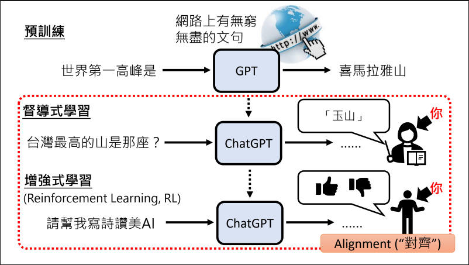

ChatGPT 真正做的事 – 文字接龍

ChatGPT : G(generative 生成） P（Pre-trained 预训练） T（Transformer）

openai tokenizer
https://platform.openai.com/tokenizer

函式的參數量(複雜程度) 人工智慧的天資
拿來學文字接龍的資料量 後天的努力

激发GPT大语言模型潜力:
需求讲清楚
提供资讯给GPT
提供范例
鼓励GPT想一想
如何找出神奇咒语
上传档案
使用其他工具