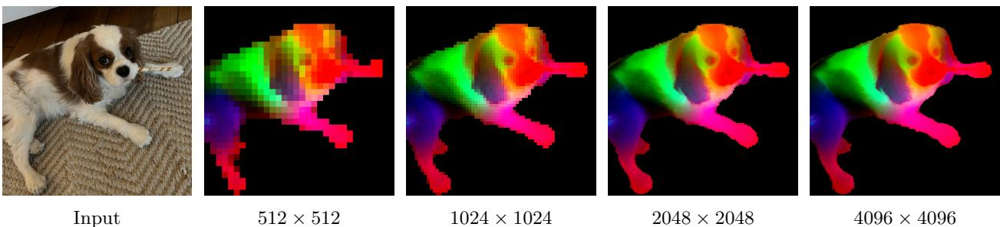

# DINOv3

- [paper](https://arxiv.org/abs/2508.10104)
- [github](https://arxiv.org/abs/2508.10104)

## 作者
Oriane Siméoni*
Huy V. Vo*  
Maximilian Seitzer*  
Federico Baldassarre*  
Maxime Oquab*  
Cijo Jose  
Vasil Khalidov  
Marc Szafraniec  
Seungeun Yi  
Michaël Ramamonjisoa   
Francisco Massa  
Daniel Haziza  
Luca Wehrstedt  
Jianyuan Wang   
Timothée Darcet  
Théo Moutakanni  
Leonel Sentana  
Claire Roberts  
Andrea Vedaldi  
Jamie Tolan  
John Brandt1  
Camille Couprie  
Julien Mairal2  
Hervé Jégou  
Patrick Labatut  
Piotr Bojanowski  

Meta AI Research  
1WRI  
2Inria  

*corresponding authors: {osimeoni,huyvvo,seitzer,baldassarre,qas}@meta.com

## 摘要 (Abstract)
自监督学习（SSL）有望消除对人工数据标注的依赖，使模型能够轻松扩展到海量数据集和更大规模的架构。由于这种训练范式不依赖特定任务或领域，它有潜力从多样化的来源中学习视觉表征——从自然影像到航拍图像——且仅需一种统一算法。本技术报告介绍了 DINOv3，这是迈向这一愿景的重要里程碑，采用了简单而有效的策略。

首先，我们通过精心的数据准备、设计和优化，充分利用了数据集与模型规模扩展的优势。其次，我们提出了一种新的方法 Gram anchoring，有效解决了在长时间训练过程中密集特征图退化的已知但未解问题。最后，我们应用了一些后处理策略，进一步提升了模型在分辨率、规模和与文本对齐方面的灵活性。

最终，我们提出了一个多功能的视觉基础模型，它无需微调即可在广泛任务中超越特定领域的最新方法。DINOv3 生成的高质量密集特征在多种视觉任务上取得了卓越表现，显著超越了先前的自监督和弱监督基础模型。我们还开源了 DINOv3 模型家族，旨在通过可扩展的解决方案，适应多样化的资源约束和部署场景，推动各类任务和数据的最新进展。

## 介绍 (Introduction)
基础模型已成为现代计算机视觉中的核心构建模块，它们通过一个通用、可复用的模型，实现跨任务和跨领域的广泛泛化。自监督学习（SSL）是一种强大的训练方式，直接从原始像素数据中学习，并利用图像中自然共现的模式。与弱监督或全监督的预训练方法不同（这些方法需要高质量的图像-标签对），SSL 能够解锁对大规模原始图像集合的训练。这对于训练大规模视觉编码器尤其有效，因为几乎可以获取无限量的训练数据。DINOv2 就很好地展现了这些优势，不仅在图像理解任务中表现出色，还支持在复杂领域（如病理学影像）中的预训练。使用 SSL 训练的模型还具有额外的优点：对输入分布偏移具有鲁棒性，能够提供强大的全局和局部特征，并能生成丰富的嵌入，帮助理解物理场景。由于 SSL 模型不是针对特定下游任务进行训练，它们能输出多用途、鲁棒的通用特征。例如，DINOv2 模型在不同任务和领域上都能取得优异表现，而无需任务特定的微调，使得单一的冻结骨干网络可以同时服务于多种用途。此外，SSL 特别适合训练在大量观测数据上，例如病理学、生物学、医学影像、遥感、天文学或高能物理等领域。这些领域通常缺乏高质量的标签元数据，已经从类似 DINOv2 这样的基础模型中获益。最后，由于 SSL 不需要人工干预，它也非常适合在不断增长的互联网数据中进行终身学习。  

然而，在实践中，自监督学习（SSL）所承诺的通过利用大量无约束数据来构建任意规模且功能强大的模型，在大规模应用时仍然面临挑战。尽管Oquab等人（2024年）的一些启发式方法缓解了训练不稳定和崩溃问题，但在进一步扩展时仍会遇到新的问题：
1.如何从无标注数据中筛选出有用的数据尚不明确；
2.常见的余弦调度方法要求事先知道训练步数，这在大规模图像语料上难以确定；
3.特征表现会在训练早期后逐渐下降，尤其是在参数量超过 3 亿的模型中，这会削弱扩展 DINOv2 的价值。

为了解决这些问题，我们提出了 DINOv3，推动 SSL 在大规模训练中的发展。我们证明，一个单一的冻结 SSL 骨干网络可以作为通用的视觉编码器，在复杂下游任务中达到甚至超越监督或依赖元数据的预训练策略。我们的研究目标包括：
- (1) 训练一个可跨任务和领域泛化的基础模型；
- (2) 改进现有 SSL 模型在密集特征上的不足；
- (3) 发布一系列可即开即用的模型。 

图1：(a) 多年来 ImageNet-1k（IN1k）上线性探针（linear probing）性能的演进，对比了全监督学习（SL）、弱监督学习（WSL）和自监督学习（SSL）方法。尽管SSL出现较晚，但其发展迅速，目前已达到近年来ImageNet准确率的平台期。另一方面，我们展示了SSL在生成高质量密集特征方面的独特优势。如(b)图所示，DINOv3在密集任务上的表现显著优于弱监督模型，体现了当前最佳的WSL模型与DINOv3之间的性能对比。此外，我们还展示了使用在自然图像（c）和航拍图像（d）上训练的DINOv3模型，从高分辨率图像中提取特征后生成的PCA特征图。

接下来的章节将详细展开这三方面的内容。 

### 强大且通用的基础模型：
DINOv3 旨在通过扩大模型规模和训练数据量，在两个维度上实现高度的通用性。首先，自监督学习（SSL）模型的一个关键理想特性是：即使在模型参数冻结（frozen）的情况下，也能取得优异的性能，理想状态下能达到与专用模型相媲美的最先进水平。在这种情况下，仅需一次前向传播即可在多种任务上获得顶尖结果，从而大幅节省计算资源——这对于实际应用，尤其是在边缘设备上的部署，具有重要意义。我们在第6节中展示了 DINOv3 成功适用的广泛任务范围。其次，一个可扩展且不依赖元数据的 SSL 训练流程，为众多科学研究应用打开了大门。通过在多样化的图像数据（无论是网络图像还是观测数据）上进行预训练，SSL 模型能够泛化到大量不同的领域和任务中。如图1(d)所示，从高分辨率航拍图像中提取的 DINOv3 特征进行主成分分析（PCA）后，能够清晰地区分道路、房屋和植被，突显了该模型特征的高质量。

### 通过 Gram Anchoring 实现更优的密集特征图：
DINOv3 的另一关键特性是其密集特征图（dense feature maps）的显著提升。DINOv3 的自监督学习训练策略旨在构建在高层语义任务上表现出色，同时也能生成高质量特征图的模型，这些特征图可直接用于解决几何任务，如深度估计或三维匹配。特别是，模型应能生成可直接开箱即用或仅需少量后处理的密集特征。然而，在使用海量图像进行训练时，密集表征与全局表征之间的平衡尤其难以优化，因为高层语义理解的目标可能与密集特征图的质量发生冲突。这种矛盾目标会导致在大模型和长时间训练下出现密集特征的坍塌（collapse）。我们提出的新方法——Gram Anchoring 策略，有效缓解了这一坍塌问题（见第4节）。因此，DINOv3 在密集特征图质量上显著优于 DINOv2，即使在高分辨率图像上也能保持清晰（见图3）。

图3：高分辨率下的密集特征。我们可视化了DINOv3输出特征中，以红十字标记的图像块（patch）与所有其他图像块之间的余弦相似度图。输入图像分辨率为4096×4096。请放大查看，您是否认同DINOv3的表现？

### DINOv3 模型家族：
通过 Gram Anchoring 解决密集特征图退化问题，释放了模型扩展的潜力。因此，使用自监督学习训练更大规模的模型带来了显著的性能提升。本文中，我们成功训练了一个参数量达70亿（7B）的 DINO 模型。由于如此大规模的模型运行需要大量资源，我们采用知识蒸馏（distillation）技术，将其知识压缩到更小的变体中。由此，我们推出了 DINOv3 视觉模型家族，这是一套全面的模型体系，旨在应对广泛的计算机视觉挑战。该模型家族致力于通过可扩展的解决方案，适应不同的资源限制和部署场景。蒸馏过程生成了多种规模的模型变体，包括 Vision Transformer（ViT）的 Small、Base 和 Large 版本，以及基于 ConvNeXt 的架构。值得注意的是，高效且广泛采用的 ViT-L 模型在多种任务上的性能已接近原始 7B 参数教师模型。总体而言，DINOv3 模型家族在广泛的基准测试中表现出色，在全局任务上的准确率达到或超过了现有竞争模型，而在密集预测任务上则显著超越它们，如图2所示。

图2：DINOv3 模型家族与其他自监督或弱监督模型家族在不同基准测试上的性能对比。DINOv3 在密集预测类基准任务上显著超越其他模型，包括那些利用掩码标注先验信息的模型（如 AM-RADIO（Heinrich 等，2025））。

### 贡献概述  
在本工作中，我们提出了多项创新，旨在应对将自监督学习（SSL）扩展至大规模前沿模型所面临的挑战。
我们基于近期在自动数据整理方面的进展（Vo 等，2024），构建了一个大规模的“背景”训练数据集，并将其与少量专用数据（ImageNet-1k）进行精心混合。这种方法能够利用大量无约束的互联网数据来提升模型性能。这一围绕数据扩展的贡献（i）将在第3.1节中详细阐述。

我们通过设计一种定制化的 Vision Transformer（ViT）架构，将主干模型的参数规模提升至70亿（7B）。我们在模型中引入了现代位置编码（轴向RoPE，axial RoPE），并开发了一种正则化技术，以避免位置相关的伪影。与DINOv2中使用的多阶段余弦学习率调度不同，我们采用固定的超参数调度方案，训练长达100万次迭代。这一改进显著提升了模型的整体性能。这一关于模型架构与训练策略的贡献（ii）将在第3.2节中进行说明。

借助上述技术，我们成功在大规模场景下实现了基于DINOv2算法的模型训练。然而，如前所述，模型规模的扩大导致了密集特征质量的退化。为解决这一问题，我们提出了一项核心改进：引入Gram Anchoring 训练阶段。该方法有效清除特征图中的噪声，生成高质量的相似性图（similarity maps），并在参数化与非参数化密集任务上显著提升性能。这一关于Gram Anchoring 训练机制的贡献（iii）将在第4节中详细描述。

沿袭以往的做法，我们流程的最后阶段包括高分辨率微调和知识蒸馏，将大模型的能力迁移到一系列不同规模的高性能小模型中。在蒸馏方面，我们开发了一种新颖且高效的“单教师-多学生”蒸馏流程。这一贡献（iv）成功将7B参数前沿模型的强大能力传递给一系列适用于实际应用的小型模型，相关内容将在第5.2节中介绍。

通过全面的基准测试（见第6节）表明，我们的方法在密集预测任务上树立了新的标杆，在全局任务上的表现也与CLIP系列模型相当。特别地，在视觉主干网络保持冻结（frozen）的前提下，我们在多个长期存在的计算机视觉任务上取得了当前最优性能：例如目标检测（COCO检测，mAP达66.1）和图像分割（ADE20k，mIoU达63.0），超越了诸多经过专门微调的模型流程。此外，在第8节中，我们将DINOv3算法应用于卫星影像领域，验证了其跨域泛化能力，并在该领域全面超越了此前所有方法。

## 2 相关工作（Related Work）

### 自监督学习（Self-Supervised Learning）

在没有标注数据的情况下进行学习，需要设计一种人工的学习任务，以提供训练所需的监督信号。自监督学习（SSL）的关键与挑战在于精心设计这类所谓的“预训练任务”（pre-text tasks），从而为下游任务学习到强大的特征表示。语言领域由于其离散性，天然地提供了许多简单直接的方式来构建此类任务，这也促成了文本数据上大量成功的无监督预训练方法。例如词嵌入（Mikolov 等，2013；Bojanowski 等，2017）、句子表示（Devlin 等，2018；Liu 等，2019），以及纯粹的语言模型（Mikolov 等，2010；Zaremba 等，2014）。相比之下，计算机视觉领域由于信号的连续性而面临更大的挑战。

早期一些模仿语言方法的尝试，通过从图像的一部分预测另一部分来生成监督信号，例如预测图像块的相对位置（Doersch 等，2015）、图像块的重新排序（Noroozi 和 Favaro，2016；Misra 和 Maaten，2020），或图像修复（inpainting，Pathak 等，2016）。其他任务还包括图像重新着色（Zhang 等，2016）或预测图像变换（Gidaris 等，2018）。

在这些任务中，基于图像修复的方法近年来受到广泛关注，这得益于基于图像块的视觉Transformer架构（ViT）的灵活性（He 等，2021；Bao 等，2021；El-Nouby 等，2021）。其目标是重建图像中被破坏的区域，这可以看作是一种去噪自编码的形式，概念上与BERT预训练中的“掩码词元预测任务”（masked token prediction）密切相关。值得注意的是，He 等（2021）证明了基于像素的掩码自编码器（MAE）可以作为下游任务微调的强有力初始化。随后，Baevski 等（2022；2023）以及 Assran 等（2023）表明，与其直接预测像素空间，不如预测一个学习得到的潜在空间，从而获得更强大、更高层次的特征——这种学习范式被称为JEPA（“联合嵌入预测架构”，Joint-Embedding Predictive Architecture，LeCun，2022）。最近，JEPA 方法也被扩展到视频训练中（Bardes 等，2024；Assran 等，2025）。

另一类与我们工作更接近的方法，则利用图像之间的判别性信号来学习视觉表示。这类方法起源于早期的深度学习研究（Hadsell 等，2006），但随着实例分类技术的提出而广受欢迎（Dosovitskiy 等，2016；Bojanowski 和 Joulin，2017；Wu 等，2018）。后续的发展引入了对比学习目标和信息论准则（Hénaff 等，2019；He 等，2020；Chen 和 He，2020；Chen 等，2020a；Grill 等，2020；Bardes 等，2021），以及基于自聚类的策略（Caron 等，2018；Asano 等，2020；Caron 等，2020；2021）。更近期的方法，例如 iBOT（Zhou 等，2021），将这些判别性损失与掩码重建目标相结合。所有这些方法都展现出学习强特征的能力，并在 ImageNet（Russakovsky 等，2015）等标准基准上取得了优异性能。然而，大多数方法在扩展到更大规模模型时面临挑战（Chen 等，2021）。

### 视觉基础模型（Vision Foundation Models）
深度学习革命始于 AlexNet 的突破（Krizhevsky 等，2012），这是一种深度卷积神经网络，在 ImageNet 挑战赛（Deng 等，2009；Russakovsky 等，2015）上表现远超此前所有方法。早在初期，人们就发现，在大规模人工标注的 ImageNet 数据集上端到端学习得到的特征，对于广泛的迁移学习任务具有极高的有效性（Oquab 等，2014）。因此，早期关于视觉基础模型的研究主要集中在架构开发上，包括 VGG（Simonyan 和 Zisserman，2015）、GoogleNet（Szegedy 等，2015）和 ResNets（He 等，2016）。

鉴于扩展规模的有效性，后续研究探索了在更大数据集上训练更大模型的方法。Sun 等（2017）使用包含 3 亿张标注图像的专有 JFT 数据集扩展了监督训练数据，取得了令人印象深刻的结果。JFT 数据集也为 Kolesnikov 等（2020）带来了显著的性能提升。与此同时，研究人员也尝试结合监督与无监督数据进行扩展。例如，可以使用在 ImageNet 上监督训练的模型为无监督数据生成伪标签，再利用这些伪标签训练更大的网络（Yalniz 等，2019）。随后，大规模监督数据集（如 JFT）的可用性也促进了 Transformer 架构在计算机视觉领域的应用（Dosovitskiy 等，2020）。特别是，若不使用 JFT 数据集，要达到原始视觉 Transformer（ViT）的性能水平需要付出巨大努力（Touvron 等，2020；2022）。由于 ViT 具有强大的学习能力，Zhai 等（2022a）进一步推进了扩展研究，最终推出了非常庞大的 ViT-22B 编码器（Dehghani 等，2023）。

鉴于大规模数据集人工标注的复杂性，弱监督训练——即通过图像关联的元数据生成标注——成为监督训练的一种有效替代方案。早期，Joulin 等（2016）证明，只需将图像标题中的所有词语作为目标进行预测，即可实现网络的预训练。这一初步方法随后被不断改进，包括利用句子结构（Li 等，2017）、引入其他类型的元数据并进行数据筛选（Mahajan 等，2018），以及扩展规模（Singh 等，2022）。然而，弱监督算法的潜力直到对比损失的引入以及文本-图像表示的联合训练才真正得以释放，典型代表为 Align（Jia 等，2021）和 CLIP（Radford 等，2021）。

这一极为成功的方法激发了大量开源复现和扩展研究。OpenCLIP（Cherti 等，2023）是首个在 LAION 数据集（Schuhmann 等，2021）上复现 CLIP 的开源项目；后续工作则通过以 CLIP 风格微调预训练主干网络来进一步提升性能（Sun 等，2023；2024）。人们认识到，数据收集是 CLIP 训练成功的关键因素，MetaCLIP（Xu 等，2024）严格遵循原始 CLIP 流程以复现其结果，而 Fang 等（2024a）则使用监督数据集来筛选预训练数据。其他研究则聚焦于改进训练损失函数，例如 SigLIP（Zhai 等，2023）中采用的 Sigmoid 损失，或利用预训练图像编码器（Zhai 等，2022b）。但归根结底，获得前沿基础模型最关键的要素仍是充足的高质量数据和强大的计算资源。在这方面，SigLIP 2（Tschannen 等，2025）和感知编码器（Perception Encoder, PE）（Bolya 等，2025）在超过 400 亿图文对上训练后取得了令人瞩目的成果。其中最大的 PE 模型在 860 亿样本上训练，全局批次大小达到 13.1 万。最后，一系列更复杂且原生多模态的方法也被提出，包括对比式描述生成（Yu 等，2022）、潜在空间中的掩码建模（Bao 等，2021；Wang 等，2022b；Fang 等，2023；Wang 等，2023a），以及自回归训练（Fini 等，2024）。

相比之下，关于扩展无监督图像预训练的研究相对较少。早期工作包括 Caron 等（2019）和 Goyal 等（2019）使用 YFCC 数据集（Thomee 等，2016）。后续进展通过使用更大规模的数据集和模型（Goyal 等，2021；2022a），以及对自监督学习（SSL）进行初步的数据筛选（Tian 等，2021）得以实现。通过对训练算法的精细调优、采用更大的模型架构以及更广泛的数据，DINOv2（Oquab 等，2024）取得了令人瞩目的成果：首次在多项任务上，无监督学习模型的表现达到甚至超过了开源 CLIP 变体。这一方向最近被 Fan 等（2025）进一步推进，他们在不进行数据筛选的情况下扩展到更大模型；Venkataramanan 等（2025）则利用开源数据集和改进的训练策略推动了该领域的发展。

### 稠密Transformer特征（Dense Transformer Features）

许多现代视觉应用依赖 Transformer 提取的稠密特征，包括多模态模型（Liu等，2023；Beyer等，2024）、生成模型（Yu等，2025；Yao等，2025）、3D理解（Wang等，2025）、视频理解（Lin等，2023a；Wang等，2024b）以及机器人技术（Driess等，2023；Kim等，2024）。此外，传统视觉任务如目标检测、语义分割或深度估计等，也需要精确的局部描述符。为了提升自监督学习（SSL）模型所生成的局部描述符质量，大量研究致力于设计面向局部特征的自监督学习损失函数。例如：利用视频中的时空一致性，通过点轨迹回环作为训练信号（Jabri等，2020）；利用同一图像不同裁剪区域之间的空间对齐关系（Pinheiro等，2020；Bardes等，2022）；或强制相邻图像块之间的特征保持一致（Yun等，2022）。Darcet等（2025）表明，预测聚类后的局部图像块有助于获得更优的密集表示。

DetCon（Hénaff等，2021）和ORL（Xie等，2021）在区域候选框上进行对比学习，但前提是这些候选框必须预先存在；这一限制在后续方法如ODIN（Hénaff等，2022）和SlotCon（Wen等，2022）中被放宽。在不改变训练目标的前提下，Darcet等（2024）发现，在输入序列中加入“register tokens”可显著提升密集特征图的质量。近期研究进一步表明，这种改进甚至可以在无需重新训练模型的情况下实现（Jiang等，2025；Chen等，2025）。

最近的一个趋势是基于知识蒸馏的“聚合式”（agglomerative）方法，这类方法融合多个图像编码器的信息，这些编码器在全局与局部特征质量方面各有优劣，并且在不同程度的监督下进行训练（Ranzinger等，2024；Bolya等，2025）。例如，AM-RADIO（Ranzinger等，2024）将全监督的SAM（Kirillov等，2023）、弱监督的CLIP以及自监督的DINOv2的优势整合为一个统一的主干网络。类似地，Perception Encoder（Bolya等，2025）将SAM(v2)的知识蒸馏到一个专用于密集表示的变体PEspatial中。他们采用一种目标函数，强制学生模型与教师模型在图像块级别的特征之间保持较高的余弦相似度，其中教师模型是使用掩码标注训练得到的。类似的损失函数在风格迁移任务中也被证明有效，其通过减小特征维度上Gram矩阵之间的不一致性来提升结果质量（Gatys等，2016；Johnson等，2016；Yoo等，2024）。在本研究中，我们采用基于Gram矩阵的目标函数来正则化学生与教师模型图像块之间的余弦相似性，鼓励它们尽可能接近。特别地，我们使用自监督模型在训练早期阶段的版本作为教师模型，证明了早期阶段的SSL模型能够有效指导后续SSL训练，同时提升全局与密集任务的表现。

另一些工作则专注于对已训练好的SSL模型的局部特征进行事后（post-hoc）优化。例如，Ziegler和Asano（2022）通过一个密集聚类目标对预训练模型进行微调；Salehi等（2023）则通过在时间维度上对齐图像块特征来实现微调，两者均有效提升了局部特征的质量。与我们更接近的工作是Pariza等（2025），他们提出一种基于图像块排序的目标函数，促使学生与教师模型生成具有相同邻域顺序的特征。无需微调的方法中，STEGO（Hamilton等，2022）在冻结的SSL特征之上学习一个非线性投影，以形成紧凑的聚类并增强相关性模式。另一种方法是Simoncini等（2024），他们通过将不同自监督目标的梯度拼接到冻结的SSL特征上来增强特征表达。最近，Wysoczańska等（2024）表明，通过对图像块进行加权平均可显著改善噪声较大的特征图。

相关但不局限于SSL的工作还包括一些近期研究，旨在从视觉Transformer（ViT）低分辨率的特征图中生成高分辨率特征图（Fu等，2024），因为ViT通常由于图像分块（patchification）而导致输出特征分辨率较低。与此类工作不同，我们的模型原生即可输出高质量的密集特征图，并且在不同分辨率下保持稳定和一致，如图4所示。

 
图4：高分辨率下的DINOv3。我们通过对特征空间进行主成分分析（PCA），并将前三个主成分映射到RGB通道，从而可视化DINOv3的密集特征。为了使PCA聚焦于主体对象，我们通过背景减除的方式对特征图进行掩码处理。随着分辨率的提高，DINOv3生成的特征更加清晰，且保持了语义上的合理性。我们在第6.1.1节中展示了更多的PCA可视化结果。

## 3 无监督大规模训练（Training at Scale Without Supervision）
DINOv3 是一种新一代模型，旨在通过推进自监督学习的边界，生成迄今为止最强大且最灵活的视觉表征。我们从大语言模型（LLMs）的成功中汲取灵感——扩大模型容量能够带来卓越的涌现特性。通过采用规模大一个数量级的模型和训练数据集，我们致力于充分释放自监督学习（SSL）的潜力，推动计算机视觉领域发生类似的范式转变，摆脱传统监督学习或特定任务方法固有的局限性。特别是，自监督学习能够生成丰富且高质量的视觉特征，这些特征不会偏向任何特定的监督信号或任务，从而为广泛的下游应用提供了通用而坚实的基础。尽管以往在扩展自监督模型方面的尝试常受训练不稳定等问题的阻碍，本节将阐述我们如何通过精心的数据准备、模型设计和优化策略，有效利用大规模训练的优势。我们首先介绍数据集的构建过程（第3.1节），然后介绍用于 DINOv3 第一阶段训练的自监督学习方案（第3.2节），包括架构选择、损失函数和优化技术。第二阶段的训练，专注于密集特征的学习，将在第4节中详细说明。

表1：训练数据对特征质量的影响，通过下游任务性能进行展示。我们将基于聚类（Vo 等，2024）和检索（Oquab 等，2024）构建的数据集，与原始数据及我们的数据混合策略进行比较。该消融实验在较短的 20 万次迭代训练周期下进行。
| Method          | IN1k k-NN | IN1k Linear | ObjectNet | iNaturalist 2021 | Paris Retrieval |
|-----------------|-----------|-------------|-----------|------------------|-----------------|
| Raw             | 80.1      | 79.4        | 84.0      | 84.8             | 70.3            |
| Clustering      | 85.4      | 86.7        | 70.7      | 81.3             | 86.0            |
| Retrieval       | 70.1      | 81.3        | 82.7      | 63.3             | 85.2            |
| LVD-1689M (ours)| **84.6**  | **87.2**    | **72.8**  | **87.0**         | **85.9**        |

### 3.1 数据准备

数据规模扩大是推动大型基础模型成功的关键因素之一（Touvron 等，2023；Radford 等，2021；Xu 等，2024；Oquab 等，2024）。然而，简单地增加训练数据的规模并不一定能够转化为更高的模型质量或在下游基准任务中取得更好的性能（Goyal 等，2021；Oquab 等，2024；Vo 等，2024）：成功的数据扩展通常依赖于精细的数据整理流程。这些算法可能有不同的目标：要么侧重于提升数据的多样性与均衡性，要么强调数据的实用性——即其在常见实际应用中的相关性。在开发 DINOv3 的过程中，我们结合了两种互补的方法，以同时提升模型的泛化能力和性能，在这两个目标之间取得平衡。

#### 数据收集与整理

我们通过利用从 Instagram 公开帖子中收集的大规模网络图像数据池来构建大规模预训练数据集。这些图像已经经过平台级别的内容审核，有助于避免有害内容，我们由此获得了一个约包含 170 亿张图像的初始数据池。基于这一原始数据池，我们构建了三个数据子集。

第一部分采用 Vo 等（2024）提出的基于分层 k-means 的自动整理方法构建。我们使用 DINOv2 提取图像嵌入，并进行五层聚类，各层级的聚类数量从底层到顶层分别为 2 亿、800 万、80 万、10 万和 2.5 万个。在构建聚类层次结构后，我们应用 Vo 等（2024）提出的均衡采样算法，最终得到一个包含 16.89 亿张图像的整理子集（命名为 LVD-1689M），确保涵盖网络上出现的所有视觉概念，并保持良好的平衡性。

第二部分采用类似于 Oquab 等（2024）提出的基于检索的整理系统。我们从数据池中检索与选定的种子数据集图像相似的图像，从而构建一个覆盖对下游任务具有重要意义的视觉概念的数据集。

第三部分则直接使用公开可用的原始计算机视觉数据集，包括 ImageNet1k（Deng 等，2009）、ImageNet22k（Russakovsky 等，2015）和 Mapillary Street-level Sequences（Warburg 等，2020）。这一部分有助于优化模型性能，方法参考了 Oquab 等（2024）的做法。

#### 数据采样

在预训练过程中，我们使用采样器将不同数据部分混合。上述数据组件的混合方式有多种选择。一种方式是在每次迭代中随机选择一个数据组件，使用来自该组件的同质批次进行训练。另一种方式是构建异质批次，即从所有组件中按一定比例选取数据进行混合训练。受 Charton 和 Kempe（2024）研究的启发——他们发现由小规模但高质量数据构成的同质批次有益于模型训练——我们在每次迭代中随机选择：要么仅从 ImageNet1k 中采样一个同质批次，要么从其余所有组件中混合采样构建一个异质批次。在我们的训练中，来自 ImageNet1k 的同质批次占总训练量的 10%。

#### 数据消融实验

为了评估我们数据整理技术的影响，我们进行了消融研究，将我们的数据组合与仅使用聚类方法、仅使用基于检索的整理方法，以及原始数据池进行对比。为此，我们在每种数据集上分别训练一个模型，并在标准下游任务上比较其性能。出于效率考虑，我们采用较短的训练计划，共 20 万次迭代，而非完整的 100 万次迭代。如表 1 所示，单一的整理方法无法在所有基准任务上均取得最佳表现，而我们的完整数据处理流程能够兼收并蓄，实现最优的整体性能。

表2：DINOv2和DINOv3模型中使用的教师网络架构对比。我们保持模型深度为40层，并将嵌入维度增加至4096。重要的是，我们采用16像素的patch大小，从而改变了给定分辨率下的有效序列长度。
| **Model**           | **DINOv2**        | **DINOv3**         |
|---------------------|-------------------|--------------------|
| **Backbone**        | ViT-giant         | ViT-7B             |
| **#Params**         | 1.1B              | 6.7B               |
| **#Blocks**         | 40                | 40                 |
| **Patch Size**      | 14                | 16                 |
| **Pos. Embeddings** | Learnable         | RoPE               |
| **Registers**       | 4                 | 4                  |
| **Embed. Dim.**     | 1536              | 4096               |
| **FFN Type**        | SwiGLU            | SwiGLU             |
| **FFN Hidden Dim.** | 4096              | 8192               |
| **Attn. Heads**     | 24                | 32                 |
| **Attn. Heads Dim.**| 64                | 128                |
| **DINO Head MLP**   | 4096-4096-256     | 8192-8192-512      |
| **DINO Prototypes** | 128k              | 256k               |
| **iBOT Head MLP**   | 4096-4096-256     | 8192-8192-384      |
| **iBOT Prototypes** | 128k              | 96k                |