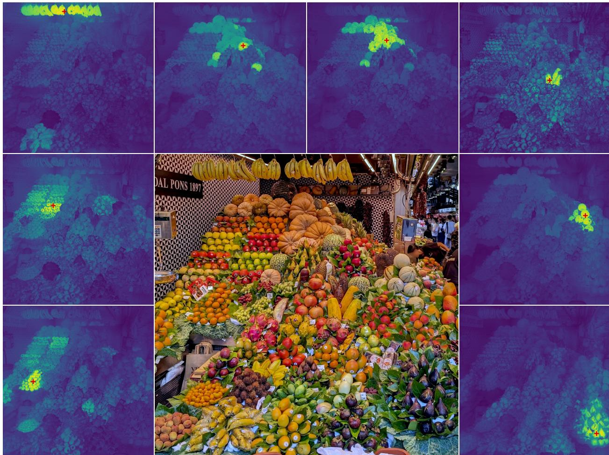
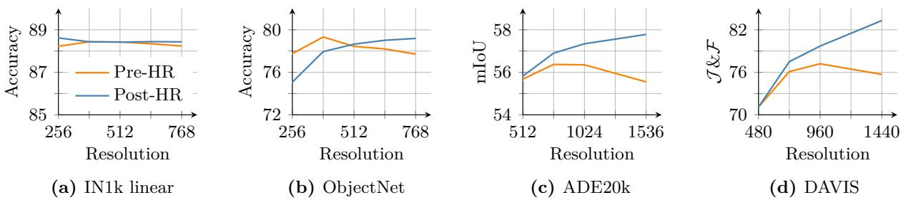
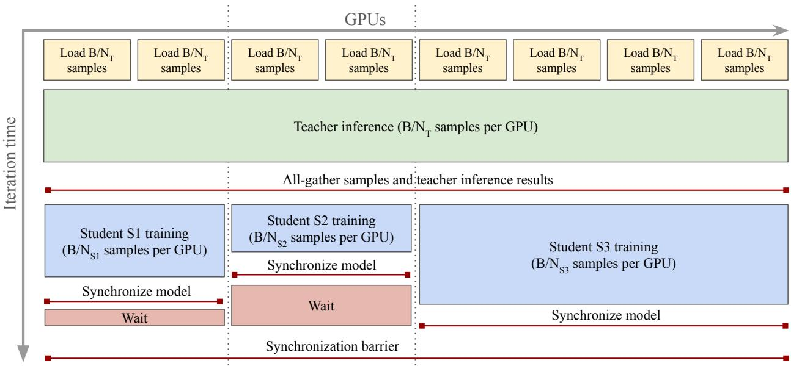
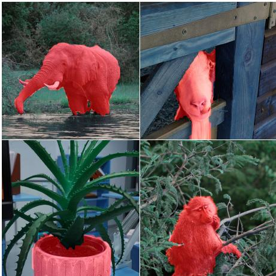

# DINOv3

- [paper](https://arxiv.org/abs/2508.10104)
- [github](https://arxiv.org/abs/2508.10104)

## 作者
Oriane Siméoni*
Huy V. Vo*  
Maximilian Seitzer*  
Federico Baldassarre*  
Maxime Oquab*  
Cijo Jose  
Vasil Khalidov  
Marc Szafraniec  
Seungeun Yi  
Michaël Ramamonjisoa   
Francisco Massa  
Daniel Haziza  
Luca Wehrstedt  
Jianyuan Wang   
Timothée Darcet  
Théo Moutakanni  
Leonel Sentana  
Claire Roberts  
Andrea Vedaldi  
Jamie Tolan  
John Brandt1  
Camille Couprie  
Julien Mairal2  
Hervé Jégou  
Patrick Labatut  
Piotr Bojanowski  

Meta AI Research  
1WRI  
2Inria  

*corresponding authors: {osimeoni,huyvvo,seitzer,baldassarre,qas}@meta.com

## 0 摘要 (Abstract)
自监督学习（SSL）有望消除对人工数据标注的依赖，使模型能够轻松扩展到海量数据集和更大规模的架构。由于这种训练范式不依赖特定任务或领域，它有潜力从多样化的来源中学习视觉表征——从自然影像到航拍图像——且仅需一种统一算法。本技术报告介绍了 DINOv3，这是迈向这一愿景的重要里程碑，采用了简单而有效的策略。

首先，我们通过精心的数据准备、设计和优化，充分利用了数据集与模型规模扩展的优势。其次，我们提出了一种新的方法 Gram anchoring，有效解决了在长时间训练过程中密集特征图退化的已知但未解问题。最后，我们应用了一些后处理策略，进一步提升了模型在分辨率、规模和与文本对齐方面的灵活性。

最终，我们提出了一个多功能的视觉基础模型，它无需微调即可在广泛任务中超越特定领域的最新方法。DINOv3 生成的高质量密集特征在多种视觉任务上取得了卓越表现，显著超越了先前的自监督和弱监督基础模型。我们还开源了 DINOv3 模型家族，旨在通过可扩展的解决方案，适应多样化的资源约束和部署场景，推动各类任务和数据的最新进展。

## 1 介绍 (Introduction)
基础模型已成为现代计算机视觉中的核心构建模块，它们通过一个通用、可复用的模型，实现跨任务和跨领域的广泛泛化。自监督学习（SSL）是一种强大的训练方式，直接从原始像素数据中学习，并利用图像中自然共现的模式。与弱监督或全监督的预训练方法不同（这些方法需要高质量的图像-标签对），SSL 能够解锁对大规模原始图像集合的训练。这对于训练大规模视觉编码器尤其有效，因为几乎可以获取无限量的训练数据。DINOv2 就很好地展现了这些优势，不仅在图像理解任务中表现出色，还支持在复杂领域（如病理学影像）中的预训练。使用 SSL 训练的模型还具有额外的优点：对输入分布偏移具有鲁棒性，能够提供强大的全局和局部特征，并能生成丰富的嵌入，帮助理解物理场景。由于 SSL 模型不是针对特定下游任务进行训练，它们能输出多用途、鲁棒的通用特征。例如，DINOv2 模型在不同任务和领域上都能取得优异表现，而无需任务特定的微调，使得单一的冻结骨干网络可以同时服务于多种用途。此外，SSL 特别适合训练在大量观测数据上，例如病理学、生物学、医学影像、遥感、天文学或高能物理等领域。这些领域通常缺乏高质量的标签元数据，已经从类似 DINOv2 这样的基础模型中获益。最后，由于 SSL 不需要人工干预，它也非常适合在不断增长的互联网数据中进行终身学习。  

然而，在实践中，自监督学习（SSL）所承诺的通过利用大量无约束数据来构建任意规模且功能强大的模型，在大规模应用时仍然面临挑战。尽管Oquab等人（2024年）的一些启发式方法缓解了训练不稳定和崩溃问题，但在进一步扩展时仍会遇到新的问题：
- 1.如何从无标注数据中筛选出有用的数据尚不明确；
- 2.常见的余弦调度方法要求事先知道训练步数，这在大规模图像语料上难以确定；
- 3.特征表现会在训练早期后逐渐下降，尤其是在参数量超过 3 亿的模型中，这会削弱扩展 DINOv2 的价值。

为了解决这些问题，我们提出了 DINOv3，推动 SSL 在大规模训练中的发展。我们证明，一个单一的冻结 SSL 骨干网络可以作为通用的视觉编码器，在复杂下游任务中达到甚至超越监督或依赖元数据的预训练策略。我们的研究目标包括：
- (1) 训练一个可跨任务和领域泛化的基础模型；
- (2) 改进现有 SSL 模型在密集特征上的不足；
- (3) 发布一系列可即开即用的模型。 

图1：(a) 多年来 ImageNet-1k（IN1k）上线性探针（linear probing）性能的演进，对比了全监督学习（SL）、弱监督学习（WSL）和自监督学习（SSL）方法。尽管SSL出现较晚，但其发展迅速，目前已达到近年来ImageNet准确率的平台期。另一方面，我们展示了SSL在生成高质量密集特征方面的独特优势。如(b)图所示，DINOv3在密集任务上的表现显著优于弱监督模型，体现了当前最佳的WSL模型与DINOv3之间的性能对比。此外，我们还展示了使用在自然图像（c）和航拍图像（d）上训练的DINOv3模型，从高分辨率图像中提取特征后生成的PCA特征图。

接下来的章节将详细展开这三方面的内容。 

### 强大且通用的基础模型：
DINOv3 旨在通过扩大模型规模和训练数据量，在两个维度上实现高度的通用性。首先，自监督学习（SSL）模型的一个关键理想特性是：即使在模型参数冻结（frozen）的情况下，也能取得优异的性能，理想状态下能达到与专用模型相媲美的最先进水平。在这种情况下，仅需一次前向传播即可在多种任务上获得顶尖结果，从而大幅节省计算资源——这对于实际应用，尤其是在边缘设备上的部署，具有重要意义。我们在第6节中展示了 DINOv3 成功适用的广泛任务范围。其次，一个可扩展且不依赖元数据的 SSL 训练流程，为众多科学研究应用打开了大门。通过在多样化的图像数据（无论是网络图像还是观测数据）上进行预训练，SSL 模型能够泛化到大量不同的领域和任务中。如图1(d)所示，从高分辨率航拍图像中提取的 DINOv3 特征进行主成分分析（PCA）后，能够清晰地区分道路、房屋和植被，突显了该模型特征的高质量。

### 通过 Gram Anchoring 实现更优的密集特征图：
DINOv3 的另一关键特性是其密集特征图（dense feature maps）的显著提升。DINOv3 的自监督学习训练策略旨在构建在高层语义任务上表现出色，同时也能生成高质量特征图的模型，这些特征图可直接用于解决几何任务，如深度估计或三维匹配。特别是，模型应能生成可直接开箱即用或仅需少量后处理的密集特征。然而，在使用海量图像进行训练时，密集表征与全局表征之间的平衡尤其难以优化，因为高层语义理解的目标可能与密集特征图的质量发生冲突。这种矛盾目标会导致在大模型和长时间训练下出现密集特征的坍塌（collapse）。我们提出的新方法——Gram Anchoring 策略，有效缓解了这一坍塌问题（见第4节）。因此，DINOv3 在密集特征图质量上显著优于 DINOv2，即使在高分辨率图像上也能保持清晰（见图3）。

图3：高分辨率下的密集特征。我们可视化了DINOv3输出特征中，以红十字标记的图像块（patch）与所有其他图像块之间的余弦相似度图。输入图像分辨率为4096×4096。请放大查看，您是否认同DINOv3的表现？

### DINOv3 模型家族：
通过 Gram Anchoring 解决密集特征图退化问题，释放了模型扩展的潜力。因此，使用自监督学习训练更大规模的模型带来了显著的性能提升。本文中，我们成功训练了一个参数量达70亿（7B）的 DINO 模型。由于如此大规模的模型运行需要大量资源，我们采用知识蒸馏（distillation）技术，将其知识压缩到更小的变体中。由此，我们推出了 DINOv3 视觉模型家族，这是一套全面的模型体系，旨在应对广泛的计算机视觉挑战。该模型家族致力于通过可扩展的解决方案，适应不同的资源限制和部署场景。蒸馏过程生成了多种规模的模型变体，包括 Vision Transformer（ViT）的 Small、Base 和 Large 版本，以及基于 ConvNeXt 的架构。值得注意的是，高效且广泛采用的 ViT-L 模型在多种任务上的性能已接近原始 7B 参数教师模型。总体而言，DINOv3 模型家族在广泛的基准测试中表现出色，在全局任务上的准确率达到或超过了现有竞争模型，而在密集预测任务上则显著超越它们，如图2所示。

图2：DINOv3 模型家族与其他自监督或弱监督模型家族在不同基准测试上的性能对比。DINOv3 在密集预测类基准任务上显著超越其他模型，包括那些利用掩码标注先验信息的模型（如 AM-RADIO（Heinrich 等，2025））。

### 贡献概述:  
在本工作中，我们提出了多项创新，旨在应对将自监督学习（SSL）扩展至大规模前沿模型所面临的挑战。
我们基于近期在自动数据整理方面的进展（Vo 等，2024），构建了一个大规模的“背景”训练数据集，并将其与少量专用数据（ImageNet-1k）进行精心混合。这种方法能够利用大量无约束的互联网数据来提升模型性能。这一围绕数据扩展的贡献（i）将在第3.1节中详细阐述。

我们通过设计一种定制化的 Vision Transformer（ViT）架构，将主干模型的参数规模提升至70亿（7B）。我们在模型中引入了现代位置编码（轴向RoPE，axial RoPE），并开发了一种正则化技术，以避免位置相关的伪影。与DINOv2中使用的多阶段余弦学习率调度不同，我们采用固定的超参数调度方案，训练长达100万次迭代。这一改进显著提升了模型的整体性能。这一关于模型架构与训练策略的贡献（ii）将在第3.2节中进行说明。

借助上述技术，我们成功在大规模场景下实现了基于DINOv2算法的模型训练。然而，如前所述，模型规模的扩大导致了密集特征质量的退化。为解决这一问题，我们提出了一项核心改进：引入Gram Anchoring 训练阶段。该方法有效清除特征图中的噪声，生成高质量的相似性图（similarity maps），并在参数化与非参数化密集任务上显著提升性能。这一关于Gram Anchoring 训练机制的贡献（iii）将在第4节中详细描述。

沿袭以往的做法，我们流程的最后阶段包括高分辨率微调和知识蒸馏，将大模型的能力迁移到一系列不同规模的高性能小模型中。在蒸馏方面，我们开发了一种新颖且高效的“单教师-多学生”蒸馏流程。这一贡献（iv）成功将7B参数前沿模型的强大能力传递给一系列适用于实际应用的小型模型，相关内容将在第5.2节中介绍。

通过全面的基准测试（见第6节）表明，我们的方法在密集预测任务上树立了新的标杆，在全局任务上的表现也与CLIP系列模型相当。特别地，在视觉主干网络保持冻结（frozen）的前提下，我们在多个长期存在的计算机视觉任务上取得了当前最优性能：例如目标检测（COCO检测，mAP达66.1）和图像分割（ADE20k，mIoU达63.0），超越了诸多经过专门微调的模型流程。此外，在第8节中，我们将DINOv3算法应用于卫星影像领域，验证了其跨域泛化能力，并在该领域全面超越了此前所有方法。

## 2 相关工作（Related Work）

### 自监督学习（Self-Supervised Learning）

在没有标注数据的情况下进行学习，需要设计一种人工的学习任务，以提供训练所需的监督信号。自监督学习（SSL）的关键与挑战在于精心设计这类所谓的“预训练任务”（pre-text tasks），从而为下游任务学习到强大的特征表示。语言领域由于其离散性，天然地提供了许多简单直接的方式来构建此类任务，这也促成了文本数据上大量成功的无监督预训练方法。例如词嵌入（Mikolov 等，2013；Bojanowski 等，2017）、句子表示（Devlin 等，2018；Liu 等，2019），以及纯粹的语言模型（Mikolov 等，2010；Zaremba 等，2014）。相比之下，计算机视觉领域由于信号的连续性而面临更大的挑战。

早期一些模仿语言方法的尝试，通过从图像的一部分预测另一部分来生成监督信号，例如预测图像块的相对位置（Doersch 等，2015）、图像块的重新排序（Noroozi 和 Favaro，2016；Misra 和 Maaten，2020），或图像修复（inpainting，Pathak 等，2016）。其他任务还包括图像重新着色（Zhang 等，2016）或预测图像变换（Gidaris 等，2018）。

在这些任务中，基于图像修复的方法近年来受到广泛关注，这得益于基于图像块的视觉Transformer架构（ViT）的灵活性（He 等，2021；Bao 等，2021；El-Nouby 等，2021）。其目标是重建图像中被破坏的区域，这可以看作是一种去噪自编码的形式，概念上与BERT预训练中的“掩码词元预测任务”（masked token prediction）密切相关。值得注意的是，He 等（2021）证明了基于像素的掩码自编码器（MAE）可以作为下游任务微调的强有力初始化。随后，Baevski 等（2022；2023）以及 Assran 等（2023）表明，与其直接预测像素空间，不如预测一个学习得到的潜在空间，从而获得更强大、更高层次的特征——这种学习范式被称为JEPA（“联合嵌入预测架构”，Joint-Embedding Predictive Architecture，LeCun，2022）。最近，JEPA 方法也被扩展到视频训练中（Bardes 等，2024；Assran 等，2025）。

另一类与我们工作更接近的方法，则利用图像之间的判别性信号来学习视觉表示。这类方法起源于早期的深度学习研究（Hadsell 等，2006），但随着实例分类技术的提出而广受欢迎（Dosovitskiy 等，2016；Bojanowski 和 Joulin，2017；Wu 等，2018）。后续的发展引入了对比学习目标和信息论准则（Hénaff 等，2019；He 等，2020；Chen 和 He，2020；Chen 等，2020a；Grill 等，2020；Bardes 等，2021），以及基于自聚类的策略（Caron 等，2018；Asano 等，2020；Caron 等，2020；2021）。更近期的方法，例如 iBOT（Zhou 等，2021），将这些判别性损失与掩码重建目标相结合。所有这些方法都展现出学习强特征的能力，并在 ImageNet（Russakovsky 等，2015）等标准基准上取得了优异性能。然而，大多数方法在扩展到更大规模模型时面临挑战（Chen 等，2021）。

### 视觉基础模型（Vision Foundation Models）
深度学习革命始于 AlexNet 的突破（Krizhevsky 等，2012），这是一种深度卷积神经网络，在 ImageNet 挑战赛（Deng 等，2009；Russakovsky 等，2015）上表现远超此前所有方法。早在初期，人们就发现，在大规模人工标注的 ImageNet 数据集上端到端学习得到的特征，对于广泛的迁移学习任务具有极高的有效性（Oquab 等，2014）。因此，早期关于视觉基础模型的研究主要集中在架构开发上，包括 VGG（Simonyan 和 Zisserman，2015）、GoogleNet（Szegedy 等，2015）和 ResNets（He 等，2016）。

鉴于扩展规模的有效性，后续研究探索了在更大数据集上训练更大模型的方法。Sun 等（2017）使用包含 3 亿张标注图像的专有 JFT 数据集扩展了监督训练数据，取得了令人印象深刻的结果。JFT 数据集也为 Kolesnikov 等（2020）带来了显著的性能提升。与此同时，研究人员也尝试结合监督与无监督数据进行扩展。例如，可以使用在 ImageNet 上监督训练的模型为无监督数据生成伪标签，再利用这些伪标签训练更大的网络（Yalniz 等，2019）。随后，大规模监督数据集（如 JFT）的可用性也促进了 Transformer 架构在计算机视觉领域的应用（Dosovitskiy 等，2020）。特别是，若不使用 JFT 数据集，要达到原始视觉 Transformer（ViT）的性能水平需要付出巨大努力（Touvron 等，2020；2022）。由于 ViT 具有强大的学习能力，Zhai 等（2022a）进一步推进了扩展研究，最终推出了非常庞大的 ViT-22B 编码器（Dehghani 等，2023）。

鉴于大规模数据集人工标注的复杂性，弱监督训练——即通过图像关联的元数据生成标注——成为监督训练的一种有效替代方案。早期，Joulin 等（2016）证明，只需将图像标题中的所有词语作为目标进行预测，即可实现网络的预训练。这一初步方法随后被不断改进，包括利用句子结构（Li 等，2017）、引入其他类型的元数据并进行数据筛选（Mahajan 等，2018），以及扩展规模（Singh 等，2022）。然而，弱监督算法的潜力直到对比损失的引入以及文本-图像表示的联合训练才真正得以释放，典型代表为 Align（Jia 等，2021）和 CLIP（Radford 等，2021）。

这一极为成功的方法激发了大量开源复现和扩展研究。OpenCLIP（Cherti 等，2023）是首个在 LAION 数据集（Schuhmann 等，2021）上复现 CLIP 的开源项目；后续工作则通过以 CLIP 风格微调预训练主干网络来进一步提升性能（Sun 等，2023；2024）。人们认识到，数据收集是 CLIP 训练成功的关键因素，MetaCLIP（Xu 等，2024）严格遵循原始 CLIP 流程以复现其结果，而 Fang 等（2024a）则使用监督数据集来筛选预训练数据。其他研究则聚焦于改进训练损失函数，例如 SigLIP（Zhai 等，2023）中采用的 Sigmoid 损失，或利用预训练图像编码器（Zhai 等，2022b）。但归根结底，获得前沿基础模型最关键的要素仍是充足的高质量数据和强大的计算资源。在这方面，SigLIP 2（Tschannen 等，2025）和感知编码器（Perception Encoder, PE）（Bolya 等，2025）在超过 400 亿图文对上训练后取得了令人瞩目的成果。其中最大的 PE 模型在 860 亿样本上训练，全局批次大小达到 13.1 万。最后，一系列更复杂且原生多模态的方法也被提出，包括对比式描述生成（Yu 等，2022）、潜在空间中的掩码建模（Bao 等，2021；Wang 等，2022b；Fang 等，2023；Wang 等，2023a），以及自回归训练（Fini 等，2024）。

相比之下，关于扩展无监督图像预训练的研究相对较少。早期工作包括 Caron 等（2019）和 Goyal 等（2019）使用 YFCC 数据集（Thomee 等，2016）。后续进展通过使用更大规模的数据集和模型（Goyal 等，2021；2022a），以及对自监督学习（SSL）进行初步的数据筛选（Tian 等，2021）得以实现。通过对训练算法的精细调优、采用更大的模型架构以及更广泛的数据，DINOv2（Oquab 等，2024）取得了令人瞩目的成果：首次在多项任务上，无监督学习模型的表现达到甚至超过了开源 CLIP 变体。这一方向最近被 Fan 等（2025）进一步推进，他们在不进行数据筛选的情况下扩展到更大模型；Venkataramanan 等（2025）则利用开源数据集和改进的训练策略推动了该领域的发展。

### 稠密Transformer特征（Dense Transformer Features）

许多现代视觉应用依赖 Transformer 提取的稠密特征，包括多模态模型（Liu等，2023；Beyer等，2024）、生成模型（Yu等，2025；Yao等，2025）、3D理解（Wang等，2025）、视频理解（Lin等，2023a；Wang等，2024b）以及机器人技术（Driess等，2023；Kim等，2024）。此外，传统视觉任务如目标检测、语义分割或深度估计等，也需要精确的局部描述符。为了提升自监督学习（SSL）模型所生成的局部描述符质量，大量研究致力于设计面向局部特征的自监督学习损失函数。例如：利用视频中的时空一致性，通过点轨迹回环作为训练信号（Jabri等，2020）；利用同一图像不同裁剪区域之间的空间对齐关系（Pinheiro等，2020；Bardes等，2022）；或强制相邻图像块之间的特征保持一致（Yun等，2022）。Darcet等（2025）表明，预测聚类后的局部图像块有助于获得更优的密集表示。

DetCon（Hénaff等，2021）和ORL（Xie等，2021）在区域候选框上进行对比学习，但前提是这些候选框必须预先存在；这一限制在后续方法如ODIN（Hénaff等，2022）和SlotCon（Wen等，2022）中被放宽。在不改变训练目标的前提下，Darcet等（2024）发现，在输入序列中加入“register tokens”可显著提升密集特征图的质量。近期研究进一步表明，这种改进甚至可以在无需重新训练模型的情况下实现（Jiang等，2025；Chen等，2025）。

最近的一个趋势是基于知识蒸馏的“聚合式”（agglomerative）方法，这类方法融合多个图像编码器的信息，这些编码器在全局与局部特征质量方面各有优劣，并且在不同程度的监督下进行训练（Ranzinger等，2024；Bolya等，2025）。例如，AM-RADIO（Ranzinger等，2024）将全监督的SAM（Kirillov等，2023）、弱监督的CLIP以及自监督的DINOv2的优势整合为一个统一的主干网络。类似地，Perception Encoder（Bolya等，2025）将SAM(v2)的知识蒸馏到一个专用于密集表示的变体PEspatial中。他们采用一种目标函数，强制学生模型与教师模型在图像块级别的特征之间保持较高的余弦相似度，其中教师模型是使用掩码标注训练得到的。类似的损失函数在风格迁移任务中也被证明有效，其通过减小特征维度上Gram矩阵之间的不一致性来提升结果质量（Gatys等，2016；Johnson等，2016；Yoo等，2024）。在本研究中，我们采用基于Gram矩阵的目标函数来正则化学生与教师模型图像块之间的余弦相似性，鼓励它们尽可能接近。特别地，我们使用自监督模型在训练早期阶段的版本作为教师模型，证明了早期阶段的SSL模型能够有效指导后续SSL训练，同时提升全局与密集任务的表现。

另一些工作则专注于对已训练好的SSL模型的局部特征进行事后（post-hoc）优化。例如，Ziegler和Asano（2022）通过一个密集聚类目标对预训练模型进行微调；Salehi等（2023）则通过在时间维度上对齐图像块特征来实现微调，两者均有效提升了局部特征的质量。与我们更接近的工作是Pariza等（2025），他们提出一种基于图像块排序的目标函数，促使学生与教师模型生成具有相同邻域顺序的特征。无需微调的方法中，STEGO（Hamilton等，2022）在冻结的SSL特征之上学习一个非线性投影，以形成紧凑的聚类并增强相关性模式。另一种方法是Simoncini等（2024），他们通过将不同自监督目标的梯度拼接到冻结的SSL特征上来增强特征表达。最近，Wysoczańska等（2024）表明，通过对图像块进行加权平均可显著改善噪声较大的特征图。

相关但不局限于SSL的工作还包括一些近期研究，旨在从视觉Transformer（ViT）低分辨率的特征图中生成高分辨率特征图（Fu等，2024），因为ViT通常由于图像分块（patchification）而导致输出特征分辨率较低。与此类工作不同，我们的模型原生即可输出高质量的密集特征图，并且在不同分辨率下保持稳定和一致，如图4所示。

 
图4：高分辨率下的DINOv3。我们通过对特征空间进行主成分分析（PCA），并将前三个主成分映射到RGB通道，从而可视化DINOv3的密集特征。为了使PCA聚焦于主体对象，我们通过背景减除的方式对特征图进行掩码处理。随着分辨率的提高，DINOv3生成的特征更加清晰，且保持了语义上的合理性。我们在第6.1.1节中展示了更多的PCA可视化结果。

## 3 无监督大规模训练（Training at Scale Without Supervision）
DINOv3 是一种新一代模型，旨在通过推进自监督学习的边界，生成迄今为止最强大且最灵活的视觉表征。我们从大语言模型（LLMs）的成功中汲取灵感——扩大模型容量能够带来卓越的涌现特性。通过采用规模大一个数量级的模型和训练数据集，我们致力于充分释放自监督学习（SSL）的潜力，推动计算机视觉领域发生类似的范式转变，摆脱传统监督学习或特定任务方法固有的局限性。特别是，自监督学习能够生成丰富且高质量的视觉特征，这些特征不会偏向任何特定的监督信号或任务，从而为广泛的下游应用提供了通用而坚实的基础。尽管以往在扩展自监督模型方面的尝试常受训练不稳定等问题的阻碍，本节将阐述我们如何通过精心的数据准备、模型设计和优化策略，有效利用大规模训练的优势。我们首先介绍数据集的构建过程（第3.1节），然后介绍用于 DINOv3 第一阶段训练的自监督学习方案（第3.2节），包括架构选择、损失函数和优化技术。第二阶段的训练，专注于密集特征的学习，将在第4节中详细说明。

### 3.1 数据准备

数据规模扩大是推动大型基础模型成功的关键因素之一（Touvron 等，2023；Radford 等，2021；Xu 等，2024；Oquab 等，2024）。然而，简单地增加训练数据的规模并不一定能够转化为更高的模型质量或在下游基准任务中取得更好的性能（Goyal 等，2021；Oquab 等，2024；Vo 等，2024）：成功的数据扩展通常依赖于精细的数据整理流程。这些算法可能有不同的目标：要么侧重于提升数据的多样性与均衡性，要么强调数据的实用性——即其在常见实际应用中的相关性。在开发 DINOv3 的过程中，我们结合了两种互补的方法，以同时提升模型的泛化能力和性能，在这两个目标之间取得平衡。

#### 数据收集与整理

我们通过利用从 Instagram 公开帖子中收集的大规模网络图像数据池来构建大规模预训练数据集。这些图像已经经过平台级别的内容审核，有助于避免有害内容，我们由此获得了一个约包含 170 亿张图像的初始数据池。基于这一原始数据池，我们构建了三个数据子集。

第一部分采用 Vo 等（2024）提出的基于分层 k-means 的自动整理方法构建。我们使用 DINOv2 提取图像嵌入，并进行五层聚类，各层级的聚类数量从底层到顶层分别为 2 亿、800 万、80 万、10 万和 2.5 万个。在构建聚类层次结构后，我们应用 Vo 等（2024）提出的均衡采样算法，最终得到一个包含 16.89 亿张图像的整理子集（命名为 LVD-1689M），确保涵盖网络上出现的所有视觉概念，并保持良好的平衡性。

第二部分采用类似于 Oquab 等（2024）提出的基于检索的整理系统。我们从数据池中检索与选定的种子数据集图像相似的图像，从而构建一个覆盖对下游任务具有重要意义的视觉概念的数据集。

第三部分则直接使用公开可用的原始计算机视觉数据集，包括 ImageNet1k（Deng 等，2009）、ImageNet22k（Russakovsky 等，2015）和 Mapillary Street-level Sequences（Warburg 等，2020）。这一部分有助于优化模型性能，方法参考了 Oquab 等（2024）的做法。

#### 数据采样

在预训练过程中，我们使用采样器将不同数据分组混合。上述数据分组的混合方式有多种选择。一种方式是在每次迭代中随机选择一个数据分组，使用来自该分组的同质批次进行训练。另一种方式是构建异质批次，即从所有分组中按一定比例选取数据进行混合训练。受 Charton 和 Kempe（2024）研究的启发——他们发现由小规模但高质量数据构成的同质批次有益于模型训练——我们在每次迭代中随机选择：要么仅从 ImageNet1k 中采样一个同质批次，要么从其余所有分组中混合采样构建一个异质批次。在我们的训练中，来自 ImageNet1k 的同质批次占总训练量的 10%。

#### 数据消融实验

为了评估我们数据整理技术的影响，我们进行了消融研究，将我们的数据组合与仅使用聚类方法、仅使用基于检索的整理方法，以及原始数据池进行对比。为此，我们在每种数据集上分别训练一个模型，并在标准下游任务上比较其性能。出于效率考虑，我们采用较短的训练计划，共 20 万次迭代，而非完整的 100 万次迭代。如表 1 所示，单一的整理方法无法在所有基准任务上均取得最佳表现，而我们的完整数据处理流程能够兼收并蓄，实现最优的整体性能。

表1：训练数据对特征质量的影响，通过下游任务性能进行展示。我们将基于聚类（Vo 等，2024）和检索（Oquab 等，2024）构建的数据集，与原始数据及我们的数据混合策略进行比较。该消融实验在较短的 20 万次迭代训练周期下进行。
<table>
<tr><td>Dataset</td><td>IN1k k-NN</td><td>IN1k Linear</td><td>ObjectNet</td><td>iNaturalist 2021</td><td>Paris Retrieval</td></tr>
<tr><td>Raw</td><td>80.1</td><td>84.8</td><td>70.3</td><td>70.1</td><td>63.3</td></tr>
<tr><td>Clustering</td><td>79.4</td><td>85.4</td><td>72.3</td><td>81.3</td><td>85.2</td></tr>
<tr><td>Retrieval</td><td>84.0</td><td>86.7</td><td>70.7</td><td>86.0</td><td>82.7</td></tr>
<tr><td>LVD-1689M (ours)</td><td>84.6</td><td>87.2</td><td>72.8</td><td>87.0</td><td>85.9</td></tr>
</table>

## 3.2 基于自监督的大规模训练

尽管使用自监督学习（SSL）训练的模型已展现出一些有趣的特性（Chen 等，2020b；Caron 等，2021），但大多数SSL算法尚未扩展到更大的模型规模。这要么是由于训练稳定性问题（Darcet 等，2025），要么是由于方法过于简单，无法充分捕捉视觉世界的复杂性。在大规模训练时（Goyal 等，2022a），SSL模型的性能并不一定表现出色。一个显著的例外是DINOv2，这是一个拥有11亿参数、在精选数据上训练的模型，其性能可与弱监督模型（如CLIP，Radford 等，2021）相媲美。最近一项将DINOv2扩展至70亿参数的尝试（Fan 等，2025）在全局任务上展现出有希望的结果，但在密集预测任务上的表现却令人失望。本文旨在进一步扩大模型和数据规模，以获得更强大的视觉表征，同时提升其全局和局部特性。

### 学习目标

我们采用一种判别式的自监督策略来训练模型，该策略结合了多种自监督目标，并包含全局和局部的损失项。借鉴 DINOv2（Oquab 等，2024）的方法，我们使用一种图像级目标（Caron 等，2021）$\mathcal{L}_{\mathrm{DINO}}$，并将其与一种基于图像块的潜在特征重建目标（Zhou 等，2021）$\mathcal{L}_{\mathrm{iBOT}}$ 进行平衡。此外，在两个目标中，我们用 SwAV（Caron 等，2020）中的 Sinkhorn-Knopp 聚类方法取代了 DINO 中的均值中心化（centering）操作。每个目标函数都通过在主干网络之上设置一个专用的预测头（dedicated head）来计算，从而允许特征在损失计算前进行一定程度的专门化。此外，我们在主干网络输出的局部和全局图像裁剪（crops）上应用了独立的层归一化（layer normalization）。实验表明，这一改动显著提升了训练后期 ImageNet 的 kNN 分类稳定性（+0.2 准确率），并改善了密集预测任务的性能（例如，在 ADE20K 语义分割任务上 mIoU 提升 +1，在 NYUv2 深度估计任务上 RMSE 降低 0.02）。此外，我们还引入了 Koleo 正则项 $\mathcal{L}_{\mathrm{Koleo}}$（Sablayrolles 等，2018），以鼓励同一批次内的特征在嵌入空间中均匀分布。我们采用了一种分布式实现的 Koleo 损失，即将损失应用于大小为 16 的小批次样本上——这些样本可能分布在多个 GPU 上。我们的初始训练阶段通过优化以下总损失函数来进行：
$$
\mathcal{L}_{\mathrm{Pre}}=\mathcal{L}_{\mathrm{DINO}}+\mathcal{L}_{\mathrm{iBOT}}+0.1*\mathcal{L}_{\mathrm{DKoleo.}}
$$

### 更新模型架构
对于本工作的模型扩展部分，我们将模型规模扩大至70亿（7B）参数，并在表2中提供了与DINOv2工作中训练的11亿（1.1B）参数模型相对应的超参数对比。我们还采用了一种自定义的RoPE变体：基础实现为每个图像块分配一个归一化范围 $[-1, 1]$ 内的坐标，然后在多头注意力操作中根据两个图像块之间的相对位置施加位置偏置。为了提升模型对不同分辨率、尺度和长宽比的鲁棒性，我们引入了RoPE-box抖动技术。具体而言，将坐标范围 $[-1, 1]$ 随机缩放到 $[-s, s]$，其中 $s \in \mathsf{\Gamma}[0.5, 2]$（即从区间 $[0.5, 2]$ 中随机采样）。这些改进共同使DINOv3能够更好地学习细致且鲁棒的视觉特征，从而提升其性能和可扩展性。

表2：DINOv2和DINOv3模型中使用的教师网络架构对比。我们保持模型深度为40层，并将嵌入维度增加至4096。重要的是，我们采用16像素的patch大小，从而改变了给定分辨率下的有效序列长度。
| **Model**           | **DINOv2**        | **DINOv3**         |
|---------------------|-------------------|--------------------|
| **Backbone**        | ViT-giant         | ViT-7B             |
| **#Params**         | 1.1B              | 6.7B               |
| **#Blocks**         | 40                | 40                 |
| **Patch Size**      | 14                | 16                 |
| **Pos. Embeddings** | Learnable         | RoPE               |
| **Registers**       | 4                 | 4                  |
| **Embed. Dim.**     | 1536              | 4096               |
| **FFN Type**        | SwiGLU            | SwiGLU             |
| **FFN Hidden Dim.** | 4096              | 8192               |
| **Attn. Heads**     | 24                | 32                 |
| **Attn. Heads Dim.**| 64                | 128                |
| **DINO Head MLP**   | 4096-4096-256     | 8192-8192-512      |
| **DINO Prototypes** | 128k              | 256k               |
| **iBOT Head MLP**   | 4096-4096-256     | 8192-8192-384      |
| **iBOT Prototypes** | 128k              | 96k                |

### 优化
在大规模数据集上训练大型模型涉及复杂的实验流程。由于模型容量与训练数据复杂性之间的相互作用难以预先评估，因此无法准确预测合适的优化周期。为了解决这一问题，我们摒弃了所有参数调度策略，采用恒定的学习率、权重衰减和教师网络EMA（指数移动平均）动量进行训练。这种做法带来了两个主要优势：第一，只要下游任务的性能仍在持续提升，我们就可以继续训练；第二，优化超参数的数量得以减少，从而更易于正确选择这些参数。为了确保训练的顺利启动，我们仍然对学习率和教师网络温度采用线性预热（linear warmup）策略。按照常规做法，我们使用AdamW优化器（Loshchilov 和 Hutter, 2017），并将总批量大小设为4096张图像，分布在256个GPU上。我们采用多裁剪策略（multi-crop strategy，Caron 等, 2020）训练模型，即每张图像生成2个全局裁剪（global crops）和8个局部裁剪（local crops）。对于全局和局部裁剪，我们分别使用边长为256和112像素的正方形图像，结合patch尺寸的调整，使得每张图像的有效序列长度与DINOv2中保持一致，整个批次的总序列长度达到370万（3.7M）个token。其他超参数详见附录C及代码发布。

## 4 格拉姆锚定：一种针对密集特征的正则化方法
为了充分释放大规模训练的优势，我们的目标是对7B模型进行长时间训练，甚至理论上可以无限期地持续训练。正如预期，延长训练时间能带来全球性基准测试性能的提升。然而，随着训练的推进，模型在密集预测任务上的表现却出现下降（见图5b和5c）。这一现象源于特征表示中出现的“局部块（patch）级不一致性”，严重削弱了延长训练的实际价值¹。在本节中，我们首先分析这种patch级一致性的丧失，随后提出一种新的优化目标来缓解该问题，称为“格拉姆锚定（Gram anchoring）”。最后，我们将讨论该方法对训练稳定性和模型性能的影响。

  
图5：ViT-g（b）和ViT-7B（c）的余弦相似度演变（a），以及在ImageNet1k线性分类（IN1k）和VOC分割任务上的准确率。我们观察到，当patch tokens与class tokens之间的余弦相似度较低时，分割性能达到最高。随着训练的进行，这些相似度逐渐增加，而密集任务（如分割）的性能则随之下降。

### 4.1 训练过程中patch级一致性的丧失
在长期训练过程中，我们观察到全局指标持续改善，但在密集预测任务上的性能却显著下降。这种现象此前在DINOv2的训练中已有轻微体现，也在Fan等人（2025）的扩展研究中被讨论过。然而，据我们所知，该问题至今尚未得到有效解决。我们在图5b和5c中展示了这一现象，图中呈现了模型在不同训练迭代次数下在图像分类与分割任务上的表现。对于分类任务，我们在ImageNet-1k数据集上使用CLS token训练一个线性分类器，并报告Top-1准确率；对于分割任务，我们则在Pascal VOC数据集上基于提取的patch特征训练一个线性层，并报告平均交并比（mIoU）。我们发现，无论是ViT-g还是ViT-7B模型，分类准确率在整个训练过程中单调提升。然而，在大约20万次迭代之后，两种模型的分割性能均开始下降，其中ViT-7B的性能甚至跌至训练初期水平以下。

为了深入理解这一性能退化现象，我们通过可视化patch之间的余弦相似度来分析patch特征的质量。图6展示了主干网络输出的patch特征与一个参考patch（以红色高亮）之间的余弦相似度图。在20万次迭代时，相似度图平滑且定位清晰，表明patch级别的特征具有一致性。然而，到了60万次迭代及以后，相似度图明显退化，越来越多无关的patch与参考patch表现出高相似度。这种patch级一致性的丧失与密集任务性能的下降密切相关。

  
图6：红色标记的图像块与其他所有图像块之间的余弦相似度的演变。随着训练的进行，模型生成的特征变得不再那么局部化，相似度图也变得更加嘈杂。

这些patch级别的异常现象不同于Darcet等人（2024）所描述的高范数patch异常值。具体而言，由于引入了register token，patch的特征范数在整个训练过程中保持稳定。但我们注意到，CLS token与各个patch输出之间的余弦相似度在训练过程中逐渐升高。这一现象虽在意料之中，但也意味着patch特征的局部性正在减弱。我们在图5a中可视化了这一现象，展示了在20万次和100万次迭代时的余弦相似度图。为缓解密集任务性能下降的问题，我们提出了一种新的优化目标，专门用于正则化patch特征，确保良好的patch级一致性，同时保持高水平的全局性能。

### 4.2 Gram锚定目标

在我们的实验过程中，我们发现学习强判别性特征与保持局部一致性之间存在相对的独立性，这一点从全局性能与密集（dense）性能之间缺乏相关性中可以观察到。尽管将全局DINO损失与局部iBOT损失相结合已初步缓解了这一问题，但我们发现这种平衡并不稳定，随着训练的进行，全局表征逐渐占据主导地位。基于这一观察，我们提出了一种新颖的解决方案，能够明确地利用这种独立性。

我们引入了一种新的目标函数，通过强化局部（patch-level）一致性的质量来缓解其退化问题，同时不直接影响特征本身。该新的损失函数作用于Gram矩阵——即图像中所有局部特征两两之间的点积构成的矩阵。我们的目标是将学生网络（student）的Gram矩阵推向一个早期模型（称为Gram教师，Gram teacher）的Gram矩阵。我们选择的Gram教师是教师网络在较早迭代阶段的一个快照，该阶段的模型表现出更优的密集特征性能。由于该方法作用于Gram矩阵而非特征本身，因此局部特征可以在空间中自由移动，只要其相似性结构保持不变。

假设一幅图像包含 $P$ 个图像块（patches），网络的特征维度为 $d$。记 $\mathbf{X}_S$（分别为 $\mathbf{X}_G$）为学生网络（分别为Gram教师）提取的 $P \times d$ 维 $\mathbf{L}_2$ 归一化的局部特征矩阵。我们定义Gram损失 $\mathcal{L}_{\mathrm{Gram}}$ 如下：

$$
\mathcal{L}_{\mathrm{Gram}} = \left\| \mathbf{X}_{S} \cdot \mathbf{X}_{S}^{\top} - \mathbf{X}_{G} \cdot \mathbf{X}_{G}^{\top} \right\|_{\mathrm{F}}^{2}
$$

我们仅在全局裁剪图像上计算该损失。尽管该损失可以较早地在训练过程中应用，但为了效率起见，我们仅在100万次迭代之后才开始使用。有趣的是，我们发现即使延迟应用 $\mathcal{L}_{\mathrm{Gram}}$，仍然能够“修复”严重退化的局部特征。为了进一步提升性能，我们每1万次迭代更新一次Gram教师网络，使其与主指数移动平均（EMA）教师网络保持一致。我们将训练的这一第二阶段称为精炼阶段，其优化目标为 $\mathcal{L}_{\mathrm{Ref}}$，其中

$$
\mathcal{L}_{\mathrm{Ref}} = w_{\mathrm{D}}\mathcal{L}_{\mathrm{DINO}} + \mathcal{L}_{\mathrm{iBOT}} + w_{\mathrm{DK}}\mathcal{L}_{\mathrm{DKoleo}} + w_{\mathrm{Gram}}\mathcal{L}_{\mathrm{Gram}}
$$

我们在图7中可视化了不同损失函数的演变过程，观察到引入Gram目标显著影响了iBOT损失，使其下降得更快。这表明，由稳定的Gram教师模型带来的稳定性对iBOT目标产生了积极影响。相比之下，Gram目标对DINO损失没有显著影响。这一观察结果意味着Gram目标和iBOT目标以类似的方式影响特征，而DINO损失则以不同的方式发挥作用。

  
图7：训练迭代过程中，图像块级别的iBOT损失、应用于全局裁剪图像的全局DINO损失以及新引入的Gram损失的变化情况。我们特别标出了使用Gram目标的精炼步骤 $\mathcal{L}_{\mathrm{Ref}}$ 的迭代过程。

在性能方面，我们观察到新损失函数的影响几乎是立竿见影的。如图8所示，在前10,000次迭代中，引入Gram锚定（Gram anchoring）便在密集型任务上带来了显著提升。此外，在对Gram教师模型进行更新后，ADE20k基准上的性能也出现了明显提升。更长时间的训练进一步提升了在ObjectNet基准上的表现，而其他全局性基准则受到新损失函数的轻微影响。

  
图8：应用我们提出的Gram锚定方法后，不同基准测试结果随训练过程的演变情况。我们展示了在原始训练基础上继续使用我们的优化步骤（ 记为$ \mathcal{L}_\mathrm{Ref} $ ）所获得的结果。同时，我们还绘制了在第4.3节中引入的、使用更高分辨率特征计算Gram目标函数时的结果（记为${ \mathcal{L}}_{\mathrm{HRef} }$）。图中突出显示了使用Gram目标函数的训练迭代阶段。

### 4.3 利用更高分辨率的特征

近期研究表明，通过对图像块特征进行加权平均，可以得到更强的局部表征，从而平滑异常图像块并增强图像块级别的特征一致性（Wysoczańska 等，2024）。另一方面，将更高分辨率的图像输入主干网络，能够生成更精细、更详细的特征图。我们结合了这两点观察的优势，为 Gram 教师模型计算高质量的特征。具体而言，我们首先将分辨率为正常两倍的图像输入 Gram 教师模型，然后使用双三次插值对生成的特征图进行 $2 \times$ 下采样，得到与学生模型输出尺寸匹配的平滑特征图。图 9a 展示了分别使用 256 和 512 分辨率图像得到的图像块特征的 Gram 矩阵，以及将 512 分辨率图像生成的特征图下采样后的结果（标记为“downsamp.”）。我们观察到，更高分辨率特征所具有的更优图像块一致性在下采样过程中得以保留，从而产生更平滑、更连贯的图像块级表征。值得一提的是，由于采用了 Su 等人（2024）提出的旋转位置嵌入（Rotary Positional Embeddings, RoPE），我们的模型能够无缝处理不同分辨率的图像，无需进行额外适配。

  

<table>
<tr><td>Method</td><td>Teacher Iteration</td><td>Res.</td><td>IN1k Linear</td><td>ADE mIoU</td><td>NYU RMSE</td></tr>
<tr><td>Baseline</td><td></td><td></td><td>88.2</td><td>50.3</td><td>0.307</td></tr>
<tr><td>GRAM</td><td>200k</td><td>×1</td><td>88.0</td><td>53.6</td><td>0.285</td></tr>
<tr><td>GRAM</td><td>200k</td><td>×2</td><td>88.0</td><td>55.7</td><td>0.281</td></tr>
<tr><td>GRAM</td><td>100k</td><td>×2</td><td>87.9</td><td>55.7</td><td>0.284</td></tr>
<tr><td>GRAM</td><td>1M</td><td>×2</td><td>88.1</td><td>54.9</td><td>0.290</td></tr>
</table>
(b) Ablation of Gram teachers and resolutions.  

图 9：高分辨率 Gram 影响的定量与定性研究。我们展示了（a）将高分辨率特征图下采样为较小尺寸后得到的改进余弦相似度图，以及（b）改变 Gram 教师模型的训练迭代次数和输入分辨率所带来的定量性能提升。

我们计算下采样后特征的 Gram 矩阵，并用其替换目标函数 $\mathcal{L}_{\mathrm{Gram}}$ 中的 $\mathbf{X}_G$，由此得到的新优化目标记为 $\mathcal{L}_{\mathrm{HRef}}$。该方法使 Gram 目标能够有效地将高分辨率平滑特征所具备的更优图像块一致性知识蒸馏到学生模型中。如图 8 和图 9b 所示，这种蒸馏在密集预测任务上带来了更好的性能表现，在 $\mathcal{L}_{\mathrm{Ref}}$ 带来的提升基础上进一步取得了增益（在 ADE20K 数据集上提升了 +2 mIoU）。我们在图 9b 中还对 Gram 教师模型的选择进行了消融实验。有趣的是，选择训练 10 万次或 20 万次的 Gram 教师模型对结果影响不大，但若使用更后期的教师模型（例如训练 100 万次），效果反而下降，因为此时教师模型的图像块一致性已有所退化。

最后，我们在图 10 中通过可视化方式定性地展示了 Gram 锚定对图像块一致性的提升效果，对比了初始训练阶段与采用高分辨率 Gram 锚定精炼后的图像块特征 Gram 矩阵。我们可以明显观察到，我们提出的高分辨率精炼方法显著改善了特征之间的相关性。

 
图10：Gram锚定的定性效果。我们可视化了使用细化目标 $ \mathcal{L}_{\mathrm{HRef}} $ 前后生成的余弦相似度图。输入图像的分辨率为 $1024 \times 1024$ 像素。

## 5 后训练阶段

本节介绍模型训练完成后的后续阶段，包括高分辨率自适应阶段（第5.1节），用于实现对不同输入分辨率的有效推理；模型蒸馏阶段（第5.2节），用于生成更小、更高效的高质量模型；以及文本对齐阶段（第5.3节），为DINOv3添加零样本学习能力。

### 5.1 分辨率扩展

我们以相对较小的256分辨率进行模型训练，这在训练速度与模型性能之间取得了良好的平衡。对于patch大小为16的情况，该设置产生的输入序列长度与DINOv2相同——DINOv2使用224分辨率和14大小的patch进行训练。然而，许多现代计算机视觉应用需要处理更高分辨率的图像，通常达到 $512 \times 512$ 像素甚至更高，以便捕捉更精细的空间信息。在实际应用中，推理时的图像分辨率也并非固定不变，而是根据具体任务需求灵活调整。为此，我们扩展了训练流程，引入了一个高分辨率自适应步骤（Touvron et al., 2019）。为了确保模型在多种分辨率下均具有高性能，我们在每个小批量中采用混合分辨率策略，随机采样不同尺寸的全局和局部裁剪图像。具体而言，全局裁剪尺寸从 {512, 768} 中选取，局部裁剪尺寸从 {112, 168, 224, 336} 中选取，并在此阶段额外训练10,000次迭代。

与主训练阶段类似，这一高分辨率自适应阶段的关键组件之一是引入Gram锚定（Gram anchoring），使用7B参数规模的教师模型作为Gram教师。我们发现这一组件至关重要：若不使用Gram锚定，模型在密集预测任务上的性能会显著下降。Gram锚定机制促使模型在不同空间位置上保持一致且鲁棒的特征相关性，这对于处理高分辨率输入带来的复杂性尤为重要。

实验结果表明，尽管这一高分辨率自适应阶段时间较短，但目标明确，显著提升了模型整体性能，并使其能够泛化到广泛多样的输入尺寸，如图4所示。在图11中，我们对比了7B模型在自适应前后的表现。可以发现，分辨率扩展在ImageNet分类任务（a）上带来了小幅提升，且在不同分辨率下的性能相对稳定。然而，在ObjectNet的OOD迁移任务（b）中，较低分辨率下的性能略有下降，而高分辨率下的性能则有所提升。这种变化被高分辨率下局部特征质量的显著改善所弥补，这一点在ADE20k上的语义分割（c）和DAVIS上的分割跟踪（d）任务中体现为性能的正向趋势。自适应后，模型的局部特征能随着图像尺寸增大而持续提升，充分利用高分辨率图像中更丰富的空间信息，从而有效支持高分辨率推理。有趣的是，经过自适应的模型甚至可以支持远超训练阶段最大分辨率（768）的输入——我们从视觉上观察到，模型在超过4K分辨率的图像上仍能生成稳定的特征图（参见图4）。

  
图11：高分辨率自适应的效果。比较在分辨率扩展前（“Pre-HR”）和扩展后（“Post-HR”）的模型表现：(a) ImageNet上线性分类性能，(b) 在ObjectNet上的OOD迁移性能，(c) ADE20k上的线性语义分割性能，(d) DAVIS上的分割跟踪性能，均在不同评估分辨率下进行测试。

### 5.2 模型蒸馏

#### 面向多种使用场景的模型家族
我们对 ViT-7B 模型进行知识蒸馏，得到一系列更小的视觉Transformer变体（ViT-S、ViT-B 和 ViT-L），这些模型因其更高的可管理性和效率而受到社区广泛青睐。我们的蒸馏方法采用了与第一训练阶段相同的训练目标，以确保学习信号的一致性。然而，不同于之前依赖模型权重的指数移动平均（EMA），我们直接使用 7B 模型作为教师模型来指导更小的学生模型训练。在此过程中，教师模型是固定的。我们未观察到 patch 级别的不一致性问题，因此无需应用 Gram 锚定技术。该策略使得蒸馏后的小模型能够继承大教师模型丰富的表征能力，同时在部署和实验中更加实用。

我们将 ViT-7B 模型蒸馏为一系列覆盖广泛计算预算的 ViT 模型，以便与同期模型进行公平比较。其中包括标准的 ViT-S（2100万参数）、ViT-B（8600万）、ViT-L（3亿），以及一个定制的 ViT-S⁺（2900万参数）和一个定制的 ViT-H⁺（8亿参数）模型，旨在缩小与自蒸馏的 7B 教师模型之间的性能差距。事实上，在 DINOv2 中我们观察到，随着蒸馏过程的进行，较小的学生模型可以达到与其教师模型相当的性能水平。因此，这些蒸馏后的模型仅需少量推理计算资源，即可实现前沿级别的性能，如表14所示。我们首先将模型训练 100 万次迭代，随后按照余弦调度进行 25 万次迭代的学习率退火，最后进入第 5.1 节所述的高分辨率阶段（不使用 Gram 锚定技术）。

#### 高效的多学生蒸馏 
由于大型教师模型的推理成本可能比学生模型高出几个数量级（见图16a），我们设计了一种并行蒸馏流水线，支持同时训练多个学生模型，并在所有参与训练的节点之间共享教师模型的推理结果（见图12示意图）。设 $C_T$ 和 $C_S$ 分别表示在单个样本上运行教师推理和学生训练的计算成本。在传统的单教师-单学生蒸馏中，若批量大小为 $B$，且 $N$ 个 GPU 各自处理 $B/N$ 的数据，则每个 GPU 的教师推理成本为 $B/N \times C_T$，学生训练成本为 $B/N \times C_S$。

  
图12：多学生并行蒸馏流程。在此示意图中，我们同时蒸馏三个学生模型：首先在所有 $\mathrm{T}$ 节点上共享教师模型的推理以节省计算开销，并在所有 GPU 上收集输入数据和推理结果；然后由较小的 GPU 组分别执行各学生模型的训练。我们调整每个学生组的规模，使得所有学生 $S_i$ 的训练步长耗时基本相同，从而最小化在同步屏障(synchronization barrier)处的空闲等待时间。

在多学生蒸馏中，我们的流程如下：每个学生模型 $S_i$ 被分配一组 $N_{S_i}$ 个 GPU 用于训练，而所有 $N_T = \sum N_{S_i}$ 个 GPU 共同组成全局推理组。在每次迭代中，我们首先在全局组上运行教师推理，每个 GPU 的计算成本为 $B / N_T \times C_T$。接着执行一次全收集（all-gather）通信操作，将输入数据和推理结果同步到所有计算节点。最后，各个学生模型的 GPU 组独立执行学生训练，计算成本为 $B / N_{S_i} \times C_{S_i}$。

上述分析表明，向蒸馏流水线中增加一个新的学生模型会带来两个优势：(1) 降低每次迭代中每个 GPU 的计算负担，从而整体提升蒸馏速度；(2) 总体计算成本仅增加该新学生模型的训练开销，因为教师模型的总推理成本已固定不变。该实现仅需精心设置 GPU 进程组，调整数据加载器和教师推理流程，确保通过 NCCL 集合通信操作在各组之间同步输入和输出数据。由于各组在每轮迭代中都需要同步，为了最大化训练速度，我们会根据各学生模型的计算需求动态调整其分配的 GPU 数量，使其单次迭代时间大致相等。通过这一流程，我们可以无缝地同时训练多个学生模型，从而从我们的旗舰 7B 模型中高效地生成一整套蒸馏模型家族。

### 5.3 将 DINOv3 与文本对齐

开放词汇的图像-文本对齐近年来受到研究社区的广泛关注和热情，这得益于其在实现灵活且可扩展的多模态理解方面的巨大潜力。大量研究工作致力于提升 CLIP（Radford 等，2021）的性能，该模型最初仅学习图像与文本表示之间的全局对齐。尽管 CLIP 展现了出色的零样本能力，但其对全局特征的关注限制了其捕捉细粒度、局部对应关系的能力。近期的研究（Zhai 等，2022b）表明，使用预训练的自监督视觉骨干网络也可以实现有效的图像-文本对齐。这使得我们能够在多模态场景中利用这些强大的模型，实现超越全局语义的更丰富、更精确的文本-图像关联，同时降低计算成本，因为视觉编码已经预先学习完成。

我们通过采用 Jose 等（2025）先前提出的训练策略，将文本编码器与我们的 DINOv3 模型进行对齐。该方法遵循 LiT 的训练范式（Zhai 等，2022b），即从零开始训练文本表示，通过对比学习目标使其与图像标题匹配，同时保持视觉编码器冻结。为了在视觉端保留一定的灵活性，我们在冻结的视觉骨干网络之上引入了两个 Transformer 层。该方法的一个关键改进在于：在与文本嵌入进行匹配之前，将平均池化的图像块嵌入（patch embeddings）与输出的 [CLS] 标记嵌入进行拼接。这一操作使得全局和局部视觉特征都能与文本对齐，从而在不引入额外启发式方法或技巧的情况下，显著提升了密集预测任务的性能。此外，我们采用了与 Jose 等（2025）相同的数据整理协议，以确保实验的一致性和可比性。

## 6 实验结果

在本节中，我们对旗舰模型 DINOv3 7B 在多种计算机视觉任务上的表现进行评估。在整个实验过程中，除非另有说明，我们始终保持 DINOv3 模型冻结，仅使用其提取的特征表示。我们证明了使用 DINOv3 无需微调即可获得优异的性能。本节内容安排如下：首先，我们通过轻量级评估协议检验 DINOv3 的密集特征（第 6.1 节）和全局图像表示（第 6.2 节）的质量，并将其与当前最先进的视觉编码器进行比较。结果表明，DINOv3 能够学习到卓越的密集特征，同时提供鲁棒且通用的全局图像表示。随后，我们将 DINOv3 作为构建更复杂计算机视觉系统的基石（第 6.3 节），展示只需在其基础上进行少量开发，即可在目标检测、语义分割、3D视角估计和相对单目深度估计等多样化任务中达到或超越当前最先进水平。

### 6.1 DINOv3 提供卓越的密集特征

我们首先通过一系列多样化的轻量级评估方法来探究 DINOv3 密集特征的原始质量。在所有实验中，我们都使用最后一层的冻结图像块（patch）特征，并通过以下方式对其进行评估：  
(1) 定性可视化分析（第 6.1.1 节），  
(2) 密集线性探针（第 6.1.2 节：语义分割、深度估计），  
(3) 非参数方法（第 6.1.3 节：3D 对应点估计，第 6.1.4 节：物体发现，第 6.1.5 节：目标跟踪）  
(4) 轻量级注意力探针（第 6.1.6 节：视频分类）。  

#### 基线模型  
我们将 DINOv3 的密集特征与目前最强大的公开图像编码器进行比较，包括弱监督和自监督方法。我们考虑以下弱监督编码器：Perception Encoder (PE) Core（Bolya 等，2025）和 SigLIP2（Tschannen 等，2025），它们均采用类似 CLIP 的图像-文本对比学习方法。同时，我们也对比了当前最强的自监督方法：DINOv3 的前身 DINOv2（Oquab 等，2024）结合 registers（Darcet 等，2024）、DINO 的近期扩展 Web-DINO（Fan 等，2025），以及目前表现最佳的开源数据自监督模型 Franca（Venkataramanan 等，2025）。此外，我们还比较了聚合型模型 AM-RADIOv2.5（Heinrich 等，2025）——该模型由 DINOv2、CLIP（Radford 等，2021）、DFN（Fang 等，2024a）和 Segment Anything（SAM）（Kirillov 等，2023）蒸馏集成而来，以及 PEspatial——将 SAM 2（Ravi 等，2025）蒸馏进 PEcore 的结果。对于每个基线模型，我们均报告其最强可用模型的性能，并在表格中注明其架构。

#### 6.1.1 定性分析

我们首先对 DINOv3 的密集特征图进行定性分析。为此，我们使用主成分分析（PCA）将密集特征空间投影到三维，并将得到的三维空间映射为 RGB 颜色图像。由于 PCA 存在符号不确定性（共八种变体），以及主成分与颜色之间的映射具有任意性（六种组合），我们尝试所有可能的组合，并选取视觉效果最清晰、最具表现力的结果进行展示。结果如图 13 所示。与其它视觉骨干网络相比，DINOv3 的特征图更加清晰，噪声更少，语义一致性显著更优。

  
图13：密集特征的比较。我们通过使用PCA对几种视觉骨干网络的密集输出进行降维，并将其映射到RGB颜色空间进行对比。从左到右依次为：SigLIP 2 ViT-g/16、PEspatial ViT-G/14、带registers的DINOv2 ViT-g/14、DINOv3 ViT-7B/16。图像输入分辨率针对patch大小为16的模型设为1280 × 960，针对patch大小为14的模型设为1120 × 840，因此所有特征图的尺寸均为80 × 60。 

#### 6.1.2 密集线性探测

我们在密集特征的基础上进行线性探测，用于两个任务：语义分割和单目深度估计。在这两种情况下，我们在冻结的 DINOv3 图像块输出之上训练一个线性变换。对于语义分割，我们在 ADE20k (Zhou 等, 2017)、Cityscapes (Cordts 等, 2016) 和 PASCAL VOC 2012 (Everingham 等, 2012) 数据集上进行评估，并报告平均交并比（mIoU）指标。对于深度估计，我们使用 NYUv2 (Silberman 等, 2012) 和 KITTI (Geiger 等, 2013) 数据集，并报告均方根误差（RMSE）。

**表3：** 在语义分割和单目深度估计任务上的密集线性探测结果（主干网络冻结）。我们在分割基准 ADE20k、Cityscapes 和 VOC 上报告平均交并比（mIoU）指标；在深度估计基准 NYUv2 和 KITTI 上报告均方根误差（RMSE）。对于分割任务，所有模型均在输入分辨率调整为 1024 个图像块标记的情况下进行评估（即，对于 patch size 为 14 的情况为 $448 \times 448$，对于 patch size 为 16 的情况为 $512 \times 512$）。

<table>
<tr><td></td><td></td><td colspan="3">Segmentation</td><td colspan="2">Depth</td></tr>
<tr><td>Method</td><td>ViT</td><td>ADE20k</td><td>Citysc.</td><td>VOC</td><td>NYUv2↓</td><td>KITTI↓</td></tr>
<tr><td colspan="7">Agglomerative backbones</td></tr><tr><td>AM-RADIOv2.5</td><td>g/14</td><td>53.0</td><td>78.4</td><td>85.4</td><td>0.340</td><td>2.918</td></tr>
<tr><td>PEspatial</td><td>G/14</td><td>49.3</td><td>73.2</td><td>82.7</td><td>0.362</td><td>3.082</td></tr>
<tr><td colspan="7">Weakly-supervised backbones</td></tr>
<tr><td>SigLIP 2</td><td>g/16</td><td>42.7</td><td>64.8</td><td>72.7</td><td>0.494</td><td>3.273</td></tr>
<tr><td>PEcore</td><td>G/14</td><td>38.9</td><td>61.1</td><td>69.2</td><td>0.590</td><td>4.119</td></tr>
<tr><td colspan="7">Self-supervised backbones</td></tr>
<tr><td>Franca</td><td>g/14</td><td>46.3</td><td>68.7</td><td>82.9</td><td>0.445</td><td>3.140</td></tr>
<tr><td>DINOv2</td><td>g/14</td><td>49.5</td><td>75.6</td><td>83.1</td><td>0.372</td><td>2.624</td></tr><tr>
<td>Web-DINO</td><td>7B/14</td><td>42.7</td><td>68.3</td><td>76.1</td><td>0.466</td><td>3.158</td></tr>
<tr><td>DINOv3</td><td>7B/16</td><td>55.9</td><td>81.1</td><td>86.6</td><td>0.309</td><td>2.346</td></tr>
</table>

**结果（表3）** 分割结果展示了我们密集特征的卓越质量。在通用的 ADE20k 数据集上，DINOv3 比自监督基线高出超过 6 个 mIoU 点，比弱监督基线高出超过 13 个点。此外，DINOv3 超过了 PEspatial 超过 6 个点，超过 AM-RADIOv2.5 近 3 个点。这些结果令人印象深刻，因为这两个基线本身非常强，它们是通过 heavily supervised 分割模型 SAM (Kirillov 等, 2023) 蒸馏而来的。在自动驾驶基准 Cityscapes 上也观察到了类似的结果，DINOv3 以 81.1 的最佳 mIoU 表现领先，比 AM-RADIOv2.5 高出 2.5 个点，比其他所有主干网络至少高出 5.5 个点。

在单目深度估计任务中，DINOv3 再次显著超越所有其他模型：弱监督模型 PEcore 和 SigLIP 2 仍表现落后，DINOv2 及基于 SAM 的更先进模型是其最接近的竞争对手。有趣的是，尽管 PEspatial 和 AM-RADIO 在 NYU 数据集上表现强劲，但在 KITTI 上的表现却低于 DINOv2。即便如此，DINOv3 仍以 0.278 RMSE 的优势优于其前代 DINOv2。

这两组评估结果均显示出 DINOv3 密集特征出色的表示能力，并与图13中的视觉结果相呼应。仅使用一个线性预测器，DINOv3 就能稳健地预测物体类别与掩码，以及场景的物理测量信息（如相对深度）。这些结果表明，这些特征不仅在视觉上清晰且定位准确，还能以线性可分的方式表达观测数据中许多重要属性。最后，仅用线性分类器在 ADE20k 上取得的绝对性能（55.9 mIoU）本身已非常出色，已接近该数据集当前最先进的绝对性能（63.0 mIoU）。

---

#### 6.1.3 3D 对应关系估计

理解三维世界一直是计算机视觉的重要目标。图像基础模型最近通过提供具备 3D 感知能力的特征，推动了三维理解的研究进展。在本节中，我们评估 DINOv3 的多视角一致性——即，同一物体在不同视角下的相同关键点的图像块特征是否相似——遵循 Probe3D (Banani 等, 2024) 所定义的评估协议。我们区分几何对应关系和语义对应关系：前者指匹配同一物体实例的关键点，后者指匹配属于同一类别但不同实例的关键点。我们在 NAVI 数据集 (Jampani 等, 2023) 上评估几何对应关系，在 SPair 数据集 (Min 等, 2019) 上评估语义对应关系，并在这两种情况下使用对应召回率（correspondence recall）作为性能度量。更多实验细节请参见附录 D.3。

**表4：密集表示的 3D 一致性的评估结果**。我们遵循 Probe3D (Banani 等, 2024) 的评估协议，跨视角估计 3D 关键点对应关系。为衡量性能，我们报告对应召回率，即落在指定距离范围内的对应关系所占的百分比。
<table>
<tr><td rowspan="2">Method</td><td rowspan="2">Vit</td><td>Geometric</td><td>Semantic</td></tr>
<tr><td>NAVI</td><td>SPair</td></tr>
<tr><td colspan="4">Agglomerative backbones</td></tr>
<tr><td>AM-RADIOv2.5</td><td>g/14</td><td>59.4</td><td>56.8</td></tr>
<tr><td>PEspatial</td><td>G/14</td><td>53.8</td><td>49.6</td></tr>
<tr><td colspan="4">Weakly-supervised backbones</td></tr>
<tr><td>SigLIP 2</td><td>g/14</td><td>49.4</td><td>42.6</td></tr>
<tr><td>PEcore</td><td>G/14</td><td>39.9</td><td>23.1</td></tr>
<tr><td colspan="4">Self-supervised backbones</td></tr>
<tr><td>Franca</td><td>g/14</td><td>54.6</td><td>51.0</td></tr>
<tr><td>DINOv2</td><td>g/14</td><td>60.1</td><td>56.1</td></tr>
<tr><td>Web-DINO</td><td>7B/14</td><td>55.0</td><td>32.2</td></tr>
<tr><td>DINOv3</td><td>7B/16</td><td>64.4</td><td>58.7</td></tr>
</table>

**结果（表4）** 在几何对应关系方面，DINOv3 超越了所有其他模型，并比第二名（DINOv2）高出 $4.3\%$ 的召回率。其他自监督学习（SSL）扩展工作（如 Franca 和 WebSSL）落后于 DINOv2，表明 DINOv2 仍然是一个强劲的基线。弱监督模型（PEcore 和 SigLIP 2）在此任务上表现不佳，表明其缺乏 3D 感知能力。对于经过 SAM 蒸馏的模型，AM-RADIO 几乎达到了 DINOv2 的性能水平，但 PEspatial 仍落后于 DINOv2（$-11.6\%$ 召回率），甚至低于 Franca（$-0.8\%$ 召回率）。这表明自监督学习是该任务取得优异表现的关键因素。在语义对应关系方面，结论相同：DINOv3 表现最佳，不仅优于其前代模型（$+2.6\%$ 召回率），也优于 AM-RADIO（$+1.9\%$ 召回率）。总体而言，DINOv3 在关键点匹配任务上的出色表现，为其在其他重度依赖 3D 信息的下游应用中的使用提供了极具前景的信号。

#### 6.1.4 无监督物体发现

强大的自监督特征使得在无需任何标注的情况下即可从图像中发现物体实例（Vo 等，2021；Siméoni 等，2021；Seitzer 等，2023；Wang 等，2023c；Siméoni 等，2025）。我们通过“无监督物体发现”任务来测试不同视觉编码器的这一能力，该任务要求对图像中的物体进行类别无关的分割（Russell 等，2006；Tuytelaars 等，2010；Cho 等，2015；Vo 等，2019）。具体而言，我们采用非参数图结构的 TokenCut 算法（Wang 等，2023c），该算法在多种主干网络上均表现出色。我们在三个广泛使用的数据集上运行该算法：VOC 2007、VOC 2012（Everingham 等，2015）和 COCO-20k（Lin 等，2014；Vo 等，2020）。我们遵循 Siméoni 等（2021）定义的评估协议，报告 CorLoc 指标。为了公平比较具有不同特征分布的主干网络，我们对 TokenCut 的主要超参数——即构建用于分割的 patch 图时所使用的余弦相似度阈值——进行了搜索。最初，DINO（Caron 等，2021）使用最后一层注意力机制中的 key 特征取得了最佳的物体发现结果。然而，这种人工设计的选择并不能一致地推广到其他主干网络。为简化起见，我们对所有模型统一使用其输出特征。

  
图 14：无监督物体发现。我们将 TokenCut（Wang 等，2022c）应用于不同主干网络的输出 patch 特征，并报告 CorLoc 指标。我们也可视化了使用 DINOv3 得到的预测掩码（以红色叠加在输入图像上，分辨率为 1024），这些结果是在无任何标注且无后处理的情况下获得的。

<table>
<tr><td>Method</td><td>ViT</td><td>VOC07</td><td>VOC12</td><td>CoCo</td></tr>
<tr><td colspan="5">Agglomerative backbones</td></tr>
<tr><td>AM-RADIOv2.5</td><td>g/14</td><td>55.0</td><td>59.7</td><td>45.9</td></tr>
<tr><td>PEspatial</td><td>G/14</td><td>51.2</td><td>56.0</td><td>43.9</td></tr>
<tr><td colspan="5">Weakly-supervised backbones</td></tr>
<tr><td>SigLIPv2</td><td>g/16</td><td>20.5</td><td>24.7</td><td>18.6</td></tr>
<tr><td>PEcore</td><td>G/14</td><td>14.2</td><td>18.2</td><td>13.5</td></tr>
<tr><td colspan="5">Self-supervised backbones</td></tr>
<tr><td>DINO</td><td>S/16</td><td>61.1</td><td>66.0</td><td>48.7</td></tr>
<tr><td>DINO</td><td>B/16</td><td>60.1</td><td>64.4</td><td>50.5</td></tr>
<tr><td>DINOv2</td><td>g/14</td><td>55.6</td><td>60.4</td><td>45.4</td></tr>
<tr><td>Web-DINO</td><td>7B/14</td><td>26.1</td><td>29.7</td><td>20.9</td></tr>
<tr><td>DINOv3</td><td>7B/16</td><td>66.1</td><td>69.5</td><td>55.1</td></tr>
</table>

**结果（图14）：** 原始的DINO在此任务上设定了非常高的基准。有趣的是，尽管DINOv2在像素级密集任务中表现出很强的性能，但在物体发现任务上却表现不佳。这在一定程度上可归因于其密集特征中存在的伪影（参见图13）。而DINOv3凭借其干净且精确的输出特征图，性能超越了前两代模型，在VOC 2007数据集上实现了5.9的CorLoc提升，也优于所有其他主干网络，无论这些网络是自监督、弱监督还是聚类方法。该评估证实，DINOv3的密集特征不仅语义表达能力强，而且定位精度高。我们相信，这将为更多类别无关的物体检测方法开辟道路，特别是在标注成本高昂或难以获取，且相关类别不限于预定义子集的应用场景中。

#### 6.1.5 视频分割跟踪

除了静态图像之外，视觉表征的一个重要属性是其时间一致性，即特征是否在时间上稳定演化。为了测试这一特性，我们在“视频分割跟踪”任务上评估 DINOv3：给定视频第一帧中的真实实例分割掩码，目标是将这些掩码传播到后续帧。我们使用 DAVIS 2017（Pont-Tuset 等，2017）、YouTube-VOS（Xu 等，2018）和 MOSE（Ding 等，2023）数据集。我们采用标准的 $\mathcal{J} \& \mathcal{F}$-mean 指标进行评估，该指标结合了区域相似性（$\mathcal{J}$）和轮廓准确性（$\mathcal{F}$）（Perazzi 等，2016）。遵循 Jabri 等（2020）的方法，我们使用一种非参数的标签传播算法，该算法考虑跨帧 patch 特征之间的相似性。我们在三种输入分辨率下进行评估，短边长度分别为 420/480（S）、840/960（M）和 1260/1440（L）像素，对应 patch 大小为 14/16 的模型（以匹配 patch token 的数量）。$\mathcal{J} \& \mathcal{F}$ 分数始终在视频的原始分辨率下计算。更详细的实验设置见附录 D.5。

<table><tr><td rowspan="2">Method</td><td rowspan="2">ViT</td><td colspan="3">DAVIS</td><td colspan="3">YouTube-VOS</td><td colspan="3">MOSE</td></tr><tr><td>S</td><td>M</td><td>L</td><td>S</td><td>M</td><td>L</td><td>S</td><td>M</td><td>L</td></tr><tr><td colspan="10">Agglomerative backbones</td></tr><tr><td>AM-RADIOv2.5</td><td>g/14</td><td>66.5</td><td>77.3</td><td>81.4</td><td>70.1</td><td>78.1</td><td>79.2</td><td>44.0</td><td>52.6</td><td>54.3</td></tr><tr><td>PEspatial</td><td>G/14</td><td>68.4</td><td>74.5</td><td>70.5</td><td>68.5</td><td>67.5</td><td>55.6</td><td>39.3</td><td>40.2</td><td>34.0</td></tr><tr><td colspan="10">Weakly-supervised backbones</td></tr><tr><td>SigLIP 2</td><td>g/16</td><td>56.1</td><td>62.3</td><td>62.9</td><td>52.0</td><td>57.3</td><td>55.1</td><td>28.0</td><td>30.3</td><td>29.2</td></tr><tr><td>PEcore</td><td>G/14</td><td>48.2</td><td>53.1</td><td>49.8</td><td>34.7</td><td>33.0</td><td>25.3</td><td>17.8</td><td>19.0</td><td>15.4</td></tr><tr><td colspan="10">Self-supervised backbones</td></tr><tr><td>Franca</td><td>g/14</td><td>61.8</td><td>66.9</td><td>66.5</td><td>67.3</td><td>70.5</td><td>67.9</td><td>40.3</td><td>42.6</td><td>41.9</td></tr><tr><td>DINOv2</td><td>g/14</td><td>63.9</td><td>73.6</td><td>76.6</td><td>65.6</td><td>73.5</td><td>74.6</td><td>40.4</td><td>47.6</td><td>48.5</td></tr><tr><td>Web-DINO</td><td>7B/14</td><td>57.2</td><td>65.8</td><td>69.5</td><td>43.9</td><td>49.6</td><td>50.9</td><td>24.9</td><td>29.9</td><td>31.1</td></tr><tr><td>DINOv3</td><td>7B/16</td><td>71.1</td><td>79.7</td><td>83.3</td><td>74.1</td><td>80.2</td><td>80.7</td><td>46.0</td><td>53.9</td><td>55.6</td></tr></table>

表 5：视频分割跟踪评估。我们在 DAVIS、YouTube-VOS 和 MOSE 数据集上报告 $\mathcal{T} \& \mathcal{F}$-mean 指标，涵盖多种分辨率。对于 patch 尺寸为 14/16 的模型，小、中、大三种分辨率分别对应视频短边为 420/480、840/960、1260/1140 像素。 

**结果（表 5）** 与之前所有结果一致，弱监督主干网络未能提供令人信服的表现。PEspatial（蒸馏自视频模型 SAMv2）表现尚可，在较低分辨率下超越 DINOv2，但在较高分辨率下表现不佳。在不同分辨率下，DINOv3 均优于所有竞争对手，在 DAVIS-L 上达到惊人的 83.3 $\mathcal{J} \& \mathcal{F}$，比 DINOv2 高出 6.7 个百分点。此外，性能随分辨率提升呈现出健康的增长趋势，表明我们的模型能够利用更多输入像素生成精确的高分辨率特征图（参见图 3 和图 4）。相比之下，SigLIP 2 和 PEcore 在更高分辨率下的性能几乎持平，而 PEspatial 的性能反而下降。有趣的是，我们的图像模型在未经过任何视频数据调优的情况下，仍能有效地在时间上跟踪物体（见图 15）。这使其成为嵌入视频的理想候选，可在此基础上构建强大的视频模型。

图 15：分割跟踪示例。给定首帧的真实实例分割掩码，我们根据 DINOv3 特征空间中图像块的相似性，将实例标签传播到后续帧。输入分辨率为 2048 × 1536 像素，生成 128 × 96 个图像块。

#### 6.1.6 视频分类

前述结果已展示了 DINOv3 表征在低层级时间一致性方面的优势，使其能够精确地在时间上追踪物体。在此基础上，本节进一步评估其密集特征在高层级视频分类任务中的适用性。我们采用与 V-JEPA 2（Assran 等，2025）相似的设置：在从每一帧独立提取的图像块（patch）特征之上，训练一个“注意力探针”（attentive probe）——一种浅层的 4 层基于 Transformer 的分类器。这种设计使得模型能够在空间和时间维度上进行推理，因为特征是逐帧独立提取的。在评估阶段，我们对每个视频要么仅使用一个视频片段（clip），要么采用测试时增强（Test-Time Augmentation, TTA）策略，即对每个视频取 3 种空间裁剪和 2 种时间裁剪，并对其预测结果取概率平均。实验细节见附录 D.6。我们在三个数据集上进行该评估：UCF101（Soomro 等，2012）、Something-Something V2（Goyal 等，2017）和 Kinetics-400（Kay 等，2017），并报告 top-1 准确率。作为额外基线，我们也列出了 V-JEPA v2 的性能表现，这是一种当前最先进的用于视频理解的自监督学习（SSL）模型。

**表 6：使用注意力探针进行的视频分类评估**。我们在 UCF101、Something-Something V2（SSv2）和 Kinetics-400（K400）上报告 top-1 准确率。对于每个模型，我们分别列出仅使用单个视频片段评估的结果，以及通过多个片段预测概率平均实现测试时增强（TTA）后的性能。
<table><tr><td></td><td></td><td colspan="2">UCF101</td><td colspan="2">SSv2</td><td colspan="2">K400</td></tr><tr><td>Method</td><td>ViT</td><td>Single</td><td>TTA</td><td>Single</td><td>TTA</td><td>Single</td><td>TTA</td></tr><tr><td colspan="8">Agglomerative backbones</td></tr><tr><td>AM-RADIOv2.5</td><td>g/14</td><td>92.8</td><td>92.5</td><td>69.1</td><td>70.0</td><td>84.8</td><td>85.2</td></tr><tr><td>PEspatial</td><td>G/14</td><td>92.7</td><td>92.8</td><td>66.4</td><td>68.4</td><td>83.5</td><td>84.8</td></tr><tr><td colspan="8"> Weakly-supervised backbones</td></tr><tr><td>SigLIP 2</td><td>g/16</td><td>93.6</td><td>94.2</td><td>68.8</td><td>70.2</td><td>86.9</td><td>87.7</td></tr><tr><td>PEcore</td><td>G/14</td><td>93.1</td><td>93.3</td><td>69.0</td><td>70.4</td><td>87.9</td><td>88.8</td></tr><tr><td colspan="8">Self-supervised backbones</td></tr><tr><td>DINOv2</td><td>g/14</td><td>93.5</td><td>93.8</td><td>67.4</td><td>68.4</td><td>84.4</td><td>85.6</td></tr><tr><td>V-JEPA 2</td><td>g/16</td><td>94.0</td><td>93.8</td><td>73.8</td><td>75.4</td><td>83.3</td><td>84.3</td></tr><tr><td>Web-DINO</td><td>7B/14</td><td>93.9</td><td>94.1</td><td>67.3</td><td>68.1</td><td>86.8</td><td>87.2</td></tr><tr><td>DINOv3</td><td>7B/16</td><td>93.5</td><td>93.5</td><td>70.1</td><td>70.8</td><td>87.8</td><td>88.2</td></tr></table>

**结果（表 6）** 与前一实验的结论一致，我们发现 DINOv3 可成功用于提取强大的视频特征。由于本次评估涉及训练多层自注意力机制，不同模型之间的差异相对较小。然而，DINOv3 的性能仍处于 PEcore 和 SigLIP 2 的同一水平，并在所有数据集上明显优于其他模型（如 DINOv2 和 AM-RADIO）。UCF101 和 K400 更关注外观信息，因此对物体类别的强理解能力决定了大部分性能表现；而 SSv2 则更依赖对动作和运动的理解——在这方面，专为视频设计的模型 V-JEPA v2 表现突出。有趣的是，在该数据集上，DINOv3 与弱监督模型之间的差距略大。这一现象再次验证了 DINOv3 在视频任务中的良好适用性。

### 6.2 DINOv3 具有强大且多用途的全局图像描述符

在本节中，我们评估 DINOv3 捕捉全局图像统计信息的能力。为此，我们考察了使用线性探针的经典分类基准（第 6.2.1 节）以及实例检索基准（第 6.2.2 节）。我们再次与目前最强大的公开可用图像编码器进行比较。除了前一节中提到的模型外，我们还评估了两个弱监督模型：AIMv2（Fini 等，2024），该模型通过联合自回归像素和文本预测进行训练；以及大规模的 EVA-CLIP-18B（Sun 等，2024）。

#### 6.2.1 使用线性探针进行图像分类

我们在 DINOv3 的输出 CLS token 上训练一个线性分类器，以评估其在分类基准上的表现。我们采用 ImageNet1k（Deng 等，2009）数据集及其变体来评估模型在分布外（out-of-distribution）场景下的鲁棒性，并选用一系列来自不同领域的数据集，以理解 DINOv3 区分细粒度类别的能力。评估细节见附录 D.7。

**从 ImageNet 进行领域泛化（表 7）** 在本实验中，我们在 ImageNet-train 上进行训练，使用 ImageNet-val 作为验证集以选择超参数，并将最优分类器迁移到不同的测试数据集上：  
- **ImageNet-V2**（Recht 等，2019）和 **ReaL**（Beyer 等，2020）是 ImageNet 的替代图像和标签集合，用于测试对 ImageNet 验证集的过拟合情况；  
- **Rendition**（Hendrycks 等，2021a）和 **Sketch**（Wang 等，2019）展示了 ImageNet 类别的风格化和人工绘制版本；  
- **Adversarial**（Hendrycks 等，2021b）和 **ObjectNet**（Barbu 等，2019）包含刻意挑选的困难样本；  
- **Corruptions**（Hendrycks 和 Dietterich，2019）用于衡量对常见图像损坏的鲁棒性。  

作为参考，我们也列出了 Dehghani 等（2023）报告的结果，这些结果来自在大规模 JFT 数据集（30–40 亿张图像）上以监督分类方式训练的 ViT 模型。需要注意的是，这些结果遵循略有不同的评估协议，因此不能直接与我们的结果进行比较。

表 7：在 ImageNet1k 上训练、使用冻结骨干网络的线性探针分类准确率。 弱监督和自监督模型在适配为 1024 个 patch token 的图像分辨率下进行评估（即：patch size 为 14 时使用 $448 \times 448$，patch size 为 16 时使用 $512 \times 512$）。作为参考，我们也列出了 Dehghani 等（2023）使用不同评估协议的结果（标有 ∗）。
<table>
<tr><td></td><td></td><td colspan="3">ImageNet</td><td colspan="2">Rendition</td><td colspan="3">Hard</td></tr>
<tr><td>Method</td><td>ViT</td><td>Val</td><td>V2</td><td>ReaL</td><td>R</td><td>S</td><td>A</td><td>C↓</td><td>Obj.</td></tr>
<tr><td colspan="10">Supervised backbones</td></tr>
<tr><td>Zhai et al. (2022a)*</td><td>G/14</td><td>89.0</td><td>81.3</td><td>90.6</td><td>91.7</td><td></td><td>78.8</td><td></td><td>69.6</td></tr>
<tr><td>Chen et al. (2023)*</td><td>e/14</td><td>89.3</td><td>82.5</td><td>90.7</td><td>94.3</td><td></td><td>81.6</td><td></td><td>71.5</td></tr>
<tr><td>Dehghani et al. (2023)*</td><td>22B/14</td><td>89.5</td><td>83.2</td><td>90.9</td><td>94.3</td><td></td><td>83.8</td><td></td><td>74.3</td></tr>
<tr><td colspan="10">Agglomerative backbones</td></tr>
<tr><td>AM-RADIOv2.5</td><td>g/14</td><td>88.0</td><td>80.2</td><td>90.3</td><td>83.8</td><td>67.1</td><td>81.3</td><td>27.1</td><td>68.4</td></tr>
<tr><td colspan="10">Weakly-superuised backbones</td></tr>
<tr><td>PEcore</td><td>G/14</td><td>89.3</td><td>81.6</td><td>90.4</td><td>92.2</td><td>71.9</td><td>89.0</td><td>22.7</td><td>80.2</td></tr>
<tr><td>SigLIP 2</td><td>g/16</td><td>89.1</td><td>81.6</td><td>90.5</td><td>92.2</td><td>71.8</td><td>84.6</td><td>30.0</td><td>78.6</td></tr>
<tr><td>AIMv2</td><td>3B/14</td><td>87.9</td><td>79.5</td><td>89.7</td><td>82.3</td><td>67.1</td><td>74.5</td><td>29.5</td><td>69.0</td></tr>
<tr><td>EVA-CLIP</td><td>18B/14</td><td>87.9</td><td>79.3</td><td>89.5</td><td>85.2</td><td>64.0</td><td>81.6</td><td>33.0</td><td>71.9</td></tr>
<tr><td colspan="10">Self-supervised backbones</td></tr>
<tr><td>Web-DINO</td><td>7B/14</td><td>85.9</td><td>77.1</td><td>88.6</td><td>75.6</td><td>64.0</td><td>71.6</td><td>31.2</td><td>69.7</td></tr>
<tr><td>Franca</td><td>g/14</td><td>84.8</td><td>75.3</td><td>89.2</td><td>67.6</td><td>49.5</td><td>56.5</td><td>40.0</td><td>54.5</td></tr>
<tr><td>DINOv2</td><td>g/14</td><td>87.3</td><td>79.5</td><td>89.9</td><td>81.1</td><td>65.4</td><td>81.7</td><td>24.1</td><td>66.4</td></tr>
<tr><td>DINOv3</td><td>7B/16</td><td>88.4</td><td>81.4</td><td>90.4</td><td>91.1</td><td>71.3</td><td>86.9</td><td>19.6</td><td>79.0</td></tr>
</table>

DINOv3 显著超越了之前所有的自监督骨干网络，在 ImageNet-R 上提升了 +10%，在 Sketch 上提升了 +6%，在 ObjectNet 上提升了 +13%，相较于此前最强的自监督学习（SSL）模型 DINOv2 有显著进步。我们注意到，目前最强的弱监督模型 SigLIP 2 和 PE 在 ImageNet-A 和 ObjectNet 等具有挑战性的分布外任务上，表现已优于最强的监督模型（如 ViT-22B）。DINOv3 在 ImageNet-R 和 Sketch 上达到了与这些模型相当的结果；在最具挑战性的任务 ImageNet-A 和 ObjectNet 上，表现略逊于 PE，但仍优于 SigLIPv2。在原始 ImageNet 上，尽管验证集准确率比 SigLIPv2 和 PE 低 0.7–0.9 个百分点，但在更“干净”的测试集 V2 和 ReaL 上，性能几乎相同。值得注意的是，DINOv3 在图像损坏鲁棒性（ImageNet-C）方面取得了最佳表现。

总体而言，这是首次有自监督学习（SSL）模型在图像分类任务上达到与弱监督和监督模型相媲美的性能——而图像分类领域过去一直是（弱）监督训练方法的强项。这一成果令人瞩目，因为像 ViT-22B、SigLIP 2 和 PE 这样的模型依赖于大规模人工标注数据集进行训练，而 DINOv3 完全仅从图像中学习，这使得未来进一步扩展和改进该方法成为可能。

**表 8：** 细粒度分类基准。 Fine-S 为 12 个数据集的平均值，完整结果见表 22。
<table>
<tr><td>Method</td><td>ViT</td><td>Fine-S</td><td>Places</td><td>iNat18</td><td>iNat21</td></tr>
<tr><td colspan="6">Agglomerative backbones</td></tr>
<tr><td>AM-RADIOv2.5</td><td>g/14</td><td>93.9</td><td>70.2</td><td>79.0</td><td>83.7</td></tr>
<tr><td colspan="6">Weakly-supervised backbones</td></tr>
<tr><td>SigLIP 2</td><td>g/16</td><td>93.7</td><td>70.5</td><td>80.7</td><td>82.7</td></tr>
<tr><td>PEcore</td><td>G/14</td><td>94.5</td><td>71.3</td><td>86.6</td><td>87.0</td></tr>
<tr><td>AIMv2</td><td>3B/14</td><td>92.9</td><td>70.7</td><td>80.8</td><td>83.2</td></tr>
<tr><td>EVA CLIP</td><td>18B/14</td><td>92.9</td><td>71.1</td><td>80.7</td><td>83.5</td></tr>
<tr><td colspan="6">Self-supervised backbones</td></tr>
<tr><td>Franca</td><td>g/14</td><td>87.7</td><td>64.6</td><td>61.4</td><td>70.6</td></tr>
<tr><td>DINOv2</td><td>g/14</td><td>92.6</td><td>68.2</td><td>80.7</td><td>86.1</td></tr>
<tr><td>Web-DINO</td><td>7B/14</td><td>90.2</td><td>69.6</td><td>65.3</td><td>74.1</td></tr>
<tr><td>DINOv3</td><td>7B/16</td><td>93.0</td><td>70.0</td><td>85.6</td><td>89.8</td></tr>
</table>

细粒度分类（表 8）我们还测量了在多个细粒度分类数据集上训练线性探针时 DINOv3 的性能。具体而言，我们报告了三个大型数据集上的准确率：Places205（Zhou 等，2014）用于场景识别，iNaturalist 2018（Van Horn 等，2018）和 iNaturalist 2021（Van Horn 等，2021）用于详细的植物和动物物种识别，以及 12 个较小数据集（涵盖场景、物体和纹理）的平均结果（如 Oquab 等（2024）中所述，此处称为 Fine-S）。各个数据集的详细结果见表 22。

我们发现，DINOv3 再次超越了此前所有的自监督学习方法。同时，其表现与弱监督方法相比也具有竞争力，表明其在多样化的细粒度分类任务中具备强大的鲁棒性和泛化能力。特别值得注意的是，DINOv3 在极具挑战性的 iNaturalist21 数据集上达到了 89.8% 的最高准确率，甚至超过了表现最佳的弱监督模型 PEcore（87.0%）。

#### 6.2.2 实例识别

为了评估我们模型在实例级别上的识别能力，我们采用了一种非参数化的检索方法。具体而言，使用输出的 CLS token 计算查询图像与数据库图像之间的余弦相似度，并据此对数据库图像进行排序。我们在多个数据集上进行了性能基准测试：用于地标识别的牛津（Oxford）和巴黎（Paris）数据集（Radenović 等，2018），包含大都会艺术博物馆艺术品图像的 Met 数据集（Ypsilantis 等，2021），以及 AmsterTime 数据集，该数据集由现代街景图像与阿姆斯特丹历史档案图像配对组成（Yildiz 等，2022）。对于 Oxford、Paris 和 AmsterTime 数据集，使用平均精度均值（mean average precision）来衡量检索效果；而对于 Met 数据集，则使用全局平均精度（global average precision）。更多评估细节请参见附录 D.8。

表 9： 实例识别基准。 更多指标见表 23。
<table>
<tr><td>Oxford-H</td><td>Paris-H</td><td>Met (GAP)</td><td>AmsterTime</td></tr>
<tr><td>47.5</td><td>85.7</td><td>30.5</td><td>23.1</td></tr>
<tr><td></td><td></td><td></td><td></td></tr>
<tr><td>25.1</td><td>60.9</td><td>13.9</td><td>15.5</td></tr>
<tr><td>32.7</td><td>68.9</td><td>10.6</td><td>23.1</td></tr>
<tr><td>28.8</td><td>71.4</td><td>29.5</td><td>14.6</td></tr>
<tr><td>27.1</td><td>65.6</td><td>0.5</td><td>18.9</td></tr>
<tr><td></td><td></td><td></td><td></td></tr>
<tr><td>14.3</td><td>51.6</td><td>27.2</td><td>21.1</td></tr>
<tr><td>58.2</td><td>84.6</td><td>44.6</td><td>48.9</td></tr>
<tr><td>31.2</td><td>80.3</td><td>35.2</td><td>30.6</td></tr>
<tr><td>60.7</td><td>87.1</td><td>55.4</td><td>56.5</td></tr>
</table>

结果（表 9 和表 23）：在所有评估的基准上，DINOv3 均以显著优势取得最佳性能，例如在 Met 数据集上比第二名 DINOv2 提升了 +10.8 个百分点，在 AmsterTime 上提升了 +7.6 个百分点。在此基准上，弱监督模型的表现远落后于 DINOv3，唯一的例外是 AM-RADIO，它是从 DINOv2 特征中蒸馏得到的。这些结果突显了 DINOv3 在实例级图像检索任务中的强大鲁棒性和广泛适用性，涵盖传统地标识别数据集以及更具挑战性的艺术作品和历史图像检索领域。

### 6.3 DINOv3 是复杂计算机视觉系统的基石

前两节已经充分展示了 DINOv3 在密集任务和全局任务中的高质量表现。然而，这些结果均基于“模型探针”（model probing）式的实验设置，即通过轻量级线性适配器或甚至非参数算法来评估特征质量。尽管这类简单的评估方式有助于排除复杂实验流程中的干扰因素，但不足以全面衡量 DINOv3 作为更大计算机视觉系统基础组件的全部潜力。因此，在本节中，我们将摆脱轻量级评估协议，转而训练更复杂的下游解码器，并与更强的、任务特定的基线方法进行比较。具体而言，我们以 DINOv3 为基础，探索其在以下任务中的应用：  
-（1）基于 Plain-DETR 的目标检测（第 6.3.1 节）；  
-（2）基于 Mask2Former 的语义分割（第 6.3.2 节）；  
-（3）基于 Depth Anything 的单目深度估计（第 6.3.3 节）；  
-（4）基于视觉几何接地变换器（Visual Geometry Grounded Transformer）的 3D 理解（第 6.3.4 节）。  
这些任务仅作为对 DINOv3 潜力的初步探索，但我们发现，基于 DINOv3 构建的系统只需少量努力即可达到具有竞争力甚至当前最优的性能。

#### 6.3.1 目标检测

作为首个任务，我们解决计算机视觉中长期存在的目标检测问题。给定一张图像，目标是为预定义类别中的所有物体实例提供边界框。该任务既需要精确的定位能力，也需要良好的识别能力——边界框需准确贴合物体轮廓，并正确对应其类别。虽然在 COCO（Lin 等，2014）等标准基准上的性能已趋于饱和，但我们提出采用冻结主干网络的方式，仅训练一个小型解码器来完成此任务。

**数据集与评估指标**：我们在 COCO 数据集（Lin 等，2014）上评估 DINOv3 的目标检测能力，并在 COCO-VAL2017 子集上报告结果。此外，我们还在 COCO-O 评估数据集（Mao 等，2023）上测试模型的分布外泛化性能。该数据集包含相同的类别，但在六种不同的分布偏移条件下提供输入图像。对于这两个数据集，我们报告在 IoU 阈值范围 [0.5:0.05:0.95] 下的平均精度均值（mAP）。对于 COCO-O，我们还额外报告有效鲁棒性（Effective Robustness, ER）。由于 COCO 数据集较小（仅包含约 11.8 万张训练图像），我们按照常规做法，利用更大的 Objects365 数据集（Shao 等，2019）对解码器进行预训练。

**表 10：与当前最先进系统在目标检测任务上的对比**。我们在冻结的 DINOv3 主干网络之上训练一个检测适配器。结果显示在 COCO 和 COCO-O 数据集的验证集上，报告了不同 IoU 阈值下的 mAP 以及有效鲁棒性（ER）。基于 DINOv3 构建的检测系统树立了新的最先进水平。由于 InternImage-G 检测模型尚未公开发布，我们无法复现其结果或计算其在 COCO-O 上的分数。
<table>
<tr><td></td><td></td><td></td><td colspan="3">Parameters</td><td colspan="2">coco</td><td colspan="2">COCO-O</td></tr>
<tr><td>Model</td><td>Detector</td><td>FT</td><td>Encoder</td><td>Decoder</td><td>Trainable</td><td>Simple</td><td>TTA</td><td>mAP</td><td>ER</td></tr>
<tr><td>EVA-02</td><td>Cascade</td><td>🔥</td><td>300M</td><td>-</td><td>300M</td><td>64.1</td><td>-</td><td>63.6</td><td>34.7</td></tr>
<tr><td>InternImage-G</td><td>DINO</td><td>🔥</td><td>6B</td><td>-</td><td>6B</td><td>65.1</td><td>65.3</td><td>-</td><td>-</td></tr>
<tr><td>EVA-02</td><td>Co-DETR</td><td>🔥</td><td>300M</td><td>-</td><td>300M</td><td>65.4</td><td>65.9</td><td>63.7</td><td>34.3</td></tr>
<tr><td>PEspatial</td><td>DETA</td><td>🔥</td><td>1.9B</td><td>50M</td><td>2B</td><td>65.3</td><td>66.0</td><td>64.0</td><td>34.7</td></tr>
<tr><td>DINOv3</td><td>Plain-DETR</td><td>❄️</td><td>7B</td><td>100M</td><td>100M</td><td>65.6</td><td>66.1</td><td>66.4</td><td>36.8</td></tr>
</table>

我们基于 Plain-DETR（Lin 等，2023b）进行构建，但做了如下修改：我们不将 Transformer 编码器融合进主干网络，而是将其作为一个独立模块保留，类似于原始 DETR（Carion 等，2020）。这使得我们能够在训练和推理过程中完全冻结 DINOv3 主干网络。据我们所知，这是首个使用冻结主干网络仍具备竞争力的检测模型。我们在 Objects365 数据集上以 1536 分辨率训练 Plain-DETR 检测器 22 个 epoch，接着以 2048 分辨率训练 1 个 epoch，然后在 COCO 数据集上以 2048 分辨率再训练 12 个 epoch。在推理时，我们使用 2048 分辨率。此外，我们还可以选择应用测试时增强（TTA），即在多个不同分辨率（从 1536 到 2880）下对图像进行前向传播。完整的实验细节见附录 D.9。

结果（表 10）我们将我们的系统与四个模型进行了比较：EVA-02 + Cascade 检测器（Fang 等，2024b）、EVA-02 + Co-DETR（Zong 等，2023）、InternImage-G + DINO（Wang 等，2023b）以及 PEspatial + DETA（Bolya 等，2025）。我们发现，这个轻量级检测器（1亿参数）在冻结的 DINOv3 主干网络上训练后，达到了最先进的性能。在 COCOO 上的性能差距尤为显著，表明检测模型能够有效利用 DINOv3 所提供的强鲁棒性特征。有趣的是，我们的模型以远少于先前模型的可训练参数实现了更优表现——即使是最小的对比模型也使用了超过 3 亿可训练参数。我们认为，这种无需对主干网络进行专门微调即可实现强大性能的能力，为多种实际应用场景提供了便利：单次主干网络前向传播即可生成支持多任务的特征，从而显著降低计算开销。

### 6.3.2 语义分割

延续上述实验，我们现在评估语义分割任务，这是计算机视觉中另一个长期存在的核心问题。该任务同样需要强大且定位精确的表征，并要求输出密集的逐像素预测。然而，与目标检测不同的是，模型不需要区分同一类别的不同实例。与检测类似，我们在冻结的 DINOv3 模型之上训练一个解码器。

**数据集与指标**  
我们主要在 ADE20k 数据集（Zhou 等，2017）上进行评估，该数据集包含 20,000 张训练图像和 2,000 张验证图像，涵盖 150 个语义类别。我们采用平均交并比（mIoU）作为评价指标。为了训练分割模型，我们额外使用了 COCOStuff（Caesar 等，2018）和 Hypersim（Roberts 等，2021）数据集，分别包含 164,000 张图像（171 类）和 77,000 张图像（40 类）。

**实现方法**  
为了构建一个将 DINOv3 特征映射到语义类别的解码器，我们结合了 ViTAdapter（Chen 等，2022）和 Mask2Former（Cheng 等，2022），类似于先前的工作（Wang 等，2022b；2023b；a）。但在我们的设置中，DINOv3 主干网络在整个训练过程中保持冻结。为避免干扰主干网络的特征表示，我们进一步修改了原始 ViT-Adapter 架构，移除了其中的 injector 组件。相比基线模型，我们还将嵌入维度从 1024 提升至 2048，以更好地处理 DINOv3 主干输出的 4096 维特征。训练流程分为三阶段：首先在 COCO-Stuff 上预训练 80,000 次迭代，接着在 Hypersim 上训练 10,000 次迭代，最后在 ADE20k 的训练集上训练 20,000 次迭代，并在验证集上报告结果。所有训练均在输入分辨率 896 下进行。在推理阶段，我们考虑两种设置：单尺度（simple），即以训练分辨率前向传播图像；多尺度（multi-scale，即 TTA），即对原始训练分辨率的 0.9 倍到 1.1 倍范围内的多个图像比例的预测结果进行平均。更多实验细节参见附录 D.10。

**表 11：ADE20k 上语义分割任务的最先进系统对比。** 我们在单尺度或多种尺度（分别为 Simple 和 TTA）设置下评估模型。遵循常见做法，本实验在 896 分辨率下运行，并报告 mIoU 分数。BEIT3、ONE-PEACE 和 DINOv3 均采用 Mask2Former 与 ViT-Adapter 架构，解码器参数已包含两者。我们在表 24 中报告了在其他数据集上的结果。

**结果（表 11）**  
我们将模型性能与多个最先进的基线进行了比较，包括 BEIT-3（Wang 等，2022b）、InternImage-H（Wang 等，2023b）和 ONE-PEACE（Wang 等，2023a），并在表 24 中报告了在其他数据集上的结果。基于冻结 DINOv3 主干的分割模型达到了最先进的性能，与 ONE-PEACE 持平（63.0 mIoU）。同时，在 COCO-Stuff（Caesar 等，2018）和 VOC 2012（Everingham 等，2012）数据集上也优于所有先前模型。由于语义分割需要精确的逐像素预测，视觉 Transformer 主干网络面临根本性挑战：其 16 像素宽的输入 patch 导致预测粒度较粗，因此催生了如 ViT-Adapter 等解决方案。另一方面，我们已证明即使在高达 4096 分辨率的情况下（参见图 3 和图 4），也能获得高质量的特征图——对应宽度达 512 token 的密集特征图。我们希望未来的工作能充分利用这些高分辨率特征，在无需依赖 ViT-Adapter 与 Mask2Former 这类重型解码器的前提下，实现最先进的性能。

---

### 6.3.3 单目深度估计

接下来，我们尝试构建一个单目深度估计系统。为此，我们采用了 Depth Anything V2（DAv2）（Yang 等，2024b）的最新先进方法框架。DAv2 的关键创新在于使用大量带有真实深度标注的合成图像进行训练。至关重要的是，该方法依赖 DINOv2 作为特征提取器，能够有效弥合仿真到真实场景之间的差距，而其他视觉主干（如 SAM（Kirillov 等，2023））则不具备这一能力（Yang 等，2024b）。因此，我们在 DAv2 的流程中将 DINOv2 替换为 DINOv3，以检验是否可以获得类似甚至更优的结果。

**实现方法**  
与 DAv2 类似，我们使用 Dense Prediction Transformer（DPT）（Ranftl 等，2021）来预测像素级深度图，输入为 DINOv3 四个等间距层的特征。我们在 DAv2 的合成数据集上使用其提出的损失函数进行训练，并将训练分辨率提升至 $1024 \times 768$，以充分发挥 DINOv3 高分辨率处理能力的优势。与 DAv2 不同的是，我们保持主干网络冻结，而非进行微调，从而测试 DINOv3 的“开箱即用”能力。我们还发现，扩大 DPT 头部结构有助于更好地利用 DINOv3 7B 版本输出的更大特征。具体细节见附录 D.11。

**数据集与指标**  
我们在五个真实世界数据集上评估模型性能：NYUv2（Silberman 等，2012）、KITTI（Geiger 等，2013）、ETH3D（Schöps 等，2017）、ScanNet（来自 Ke 等（2025））和 DIODE（Vasiljevic 等，2019），评估设置为零样本尺度不变深度估计（zero-shot scale-invariant depth），类似于 Ranftl 等（2020）和 Ke 等（2025）的方法。

**表 12：相对单目深度估计任务的最先进系统对比。** 通过将 DINOv3 与 Depth Anything V2（Yang 等，2024b）结合，我们获得了相对深度估计任务上的最先进模型。